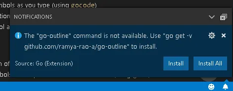

# VSCode Go Eklentisi Yükleme

Golang’ı indirdiğimize göre bize Golang kodlarımızı yazacağımız bir Tümleşik Geliştirme Ortamı (IDE) lazım. IDE’ler kodlarımızı yazarken kodların doğruluğunu kontrol eder ve kod yazarken önerilerde bulunur. Bu da kod yazarken işimizi kolaylaştırır.

Benim tavsiyem çoğu kodlama dilini yazarken kullandığım ve Golang yazanların da popüler olarak kullandığı **Visual Studio Code** programı.

Buradan İndirebilirsiniz

[https://code.visualstudio.com/Download](https://code.visualstudio.com/Download)

Linux İS kullananlara yine kullandıkları dağıtımın uygulama deposundan indirmelerini tavsiye ediyorum.

Visual Studio Code’dan ilerki zamanlarda **vscode** olarak bahsedeceğim.

Go eklentisinin düzgün bir şekilde kurulabilmesi için bilgisayarımızda **git** komut-satırı uygulaması bulunması gerekir. Çünkü eklentinin yüklenmesinden sonra Go eklentisi VSCode için 15 civarı aracı otomatik indirecek. Git’in yüklü olup olmadığını öğrenmek için komut satırına aşağıdakileri yazın:

Eğer versiyon numarasını gördüyseniz yüklü demektir. Eğer yüklü değilse veya git’i güncellemek istiyorsanız ki, mutlaka öneririm, aşağıda nasıl yükleneceğini görebilirsiniz.

`git --version`

Windows MacOS

Windows için: [Buradan İndirebilirsiniz](https://git-scm.com/download/win)

MacOS: [Buradan İndirebilirsiniz.](https://git-scm.com/download/mac)

**GNU/Linux İşletim Sistemleri**

**Debian/Ubuntu**

`sudo apt-get install git`

**Fedora**

`dnf install git`

**Arch Linux**

`sudo pacman -S git`

**Gentoo**

`emerge --ask --verbose dev-vcs/git`

**openSUSE**

`zypper install git`

**Mageia**

`urpmi git`

Git kurulumunu da yaptığımıza göre VSCode için Go eklentisini kurabiliriz.

Vscode’un sol tarafından **Extension** (Eklentiler) sekmesine geçiyoruz. Arama kutusuna **go** yazıyoruz. Resimde de seçili olan Go eklentisini yeşil **Install (Yükle)** butonuna basarak yüklüyoruz. Yeniden başlatma isterse başlatmayı unutmayın.

Daha sonra **main.go** adında bir dosya oluşturup VSCode ile açalım. main.go dosyasının içerisine rastgele birşeyler yazdığımızda VSCode sağ alt tarafta bize uyarı verecektir.

**Install All** diyerek Go eklentisi araçlarının kurulumunu başlatalım.

Kurulum bize 15 civarı araç kuracak. Başarı ile kurulan araçların yanında **SUCCEED** ibaresi yer alır.

Tüm araçlarımız başarıyla kurulunca artık VSCode üzerinden Go geliştirmeye hazır olacaksınız.

##
