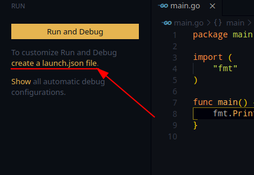
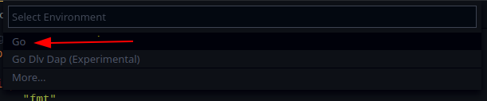
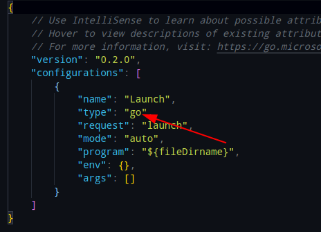

# VSCode Varsayılan Hata Ayıklayıcıyı Seçme

VSCode Go programlama yapıyorken, **F5** tuşuna bastığınızda üst tarafta hata ayıklayıcıyı seçmenizi ister. Her **F5** tuşuna bastığınızda hata ayıklayıcı seçim ekranı çıksın istemiyorsanız, yani herzaman bir hata ayıklayıcıyı kullansız istiyorsanız, yapacaklarınız çok basit.

VSCode üzerinde ekranın sol tarafından Run sekmesine geçelim.

Biz varsayılan olarak **Go Hata Ayıklayıcısı**'nı seçeceğiz.

**Go**'yu varsayılan hale getirmek içinse, ekranın solundan `create a launch.json file` bağlantısına tıklayalım.

Üst tarafta açılan ekrandan **Go**'yu seçelim.

Seçtikten sonra VSCode bizim için `launch.json` adında bir dosya oluşturacak. Bu dosya **F5** tuşuna bastığımızda gerçekleşecek olayları barındıryor. Dikkat edeceğimiz nokta type bölümünde go yazıyor olması.

Daha sonra `launch.json` dosyamızı kaydedip kapatabiliriz.

Bir sonra hata ayıklama işleminde **Go** otomatik çalışacaktır.
