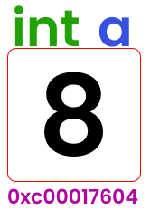

# Pointers \(İşaretçiler\)

İşaretçiler ile nesnenin bellekteki adresi üzerinden işlemler yapabilir. Daha önceden işaretçileri içeren bir dil kullanmamış veya herhangi bir programlama dili de kullanmamış olabilirsiniz. Bu yüzden daha iyi anlamanız için işaretçilerin çalışma mantığını bilmemiz gerekir.

Örnek olarak `a` isminde bir değişkenimiz olsun. Bu değişkenimiz `tam sayı (int)` tipinde `8` değerini saklıyor olsun. Bu da Go dilinde aşağıdaki gibi oluyor.

```go
var a int = 8
```

Bu değişkenimizi oluşturduktan sonra programımız çalışmaya başlayınca işletim sistemimiz bu değişkene özel, **bellek \(RAM\)** üzerinde bir alan ayıracaktır. Programın geri kalanında değişkenimizin değerine bu alan üzerinden ulaşılacaktır. Yani bir değişken oluşturduğumuzda bellek üzerinde aşağıdaki resimdeki gibi bir alan oluştuğunu hayal edebilirsiniz.



Yukarıdaki resimde mor renkli olarak gördüğümüz ifade ise değişkenimizin bellekteki adresidir. \(Bu adres temsilidir. Zaten sürekli olarak değişen birşeydir.\)

## Peki Go'da işaretçileri nasıl kullanırız?

Bir program senaryosu belirleyelim. Bu programımızda yukarıdaki gibi `a` isminde `int` tipinde `8` değerini tutan bir değişkenimiz olsun. Ve `a` değişkenimize `5` ekleyen bir fonksiyonumuz olsun. Son olarak `a`'yı ekrana bastıralım.

```go
package main

import "fmt"

func main() {
	a := 8
	ekle(a)
	fmt.Println(a)
	//sonucumuz yine 8 olacak
}
func ekle(v int) {
	v += 5
}
```

Yukarıdaki örnekte `a` değişkenini ekrana bastırdığımızda sonucun hala `8` olduğunu görüyoruz. Halbuki `ekle` fonksiyonunun içerisinde gördüğümün gibi `5` ekliyoruz.

`a` değişkeninin değişmeme sebebi şudur:  
`ekle` fonksiyonunun parametresi olarak `int` tipinde `v` değişkenini oluşturduk. `v` değişkenimiz aslında `a`'dan gelen değeri kullanmamızı sağlıyor. Yani bize `a`'nın kendisini vermiyor. O yüzden `v` üzerinde değişiklik yaptığımızda `a`'ya yansımayacaktır.

`a` değişkenini değiştirebilmemiz için bize `a`'nın bellekteki adresi gerekiyor. Bunun için de `&` \(ampersand\) işaretini kullanabiliriz.


Örnek vermek gerekirse:

```go
func main() {
	a := 8
	fmt.Println(&a) //Çıktımız: 0xc0000b8010
}
```

Artık `a`'nın bellekteki adresini öğrenebiliyoruz. Sıra geldi bu adres üzerinden `a`'nın değerine ulaşabilmeye.

Bunun için de `*` \(yıldız\) işaretini kullanabiliriz.

```go
func main() {
	a := 8
	fmt.Println(&a) //Çıktımız: 0xc0000b8010
	b := &a
	fmt.Println(b) //Çıktımız: 0xc0000b8010
	fmt.Println(*b) //Çıktımız: 8
}
```

Yukarıdaki örneği incelediğimizde `b` değişkenine `a`'nın adresini atadık. `b`'yi bastırdığımızda `a`'nın bellekteki adresini görebiliriz. Aynı zamanda `*b` şeklinde kullanarak `a`'nın içindeki değere de ulaşabiliriz. Bu durumda a ve bdeğişkenleri aynı bellek alanını temsil ediyorlar.

`a` değişkenine `b` üzerinden değişiklik yapmak için aşağıdaki yöntemi uygulayabilirsiniz.

```go
package main

import "fmt"

func main() {
	a := 8
	b := &a
	*b = 10
	fmt.Println(a) //10
}
```

En başta kurguladığımız senaryoyu işaretçiler ile kolayca yapabiliriz.

```go
package main

import "fmt"

func main() {
	a := 8
	ekle(&a)
	fmt.Println(a) //Çıktımız: 13
}
func ekle(v *int) {
	*v += 5
}
```

Yukarıdaki örneği incelediğimizde, `ekle` fonksiyonumuzu oluştururken parametre olarak verdiğimiz `v` değişkeninin tipinde önce `*` işareti koyduk. Bunun sebebi `v` değişkeni ile fonksiyonumuza gelecek olan adresin içindeki değere ulaşabilmektir.

`ekle` fonksiyonunun içerisindeki `v`'yi kullanırken de başına `*` koyarak kullandık.

`main` fonksiyonumuzda `ekle` fonksiyonunu çağırırken de `a` değişkenini `&` işareti kullanarak bellekteki adresi ile verdik.

Bu sayede `a` değişkenine bellekteki adresi ile müdahale etmiş olduk.

