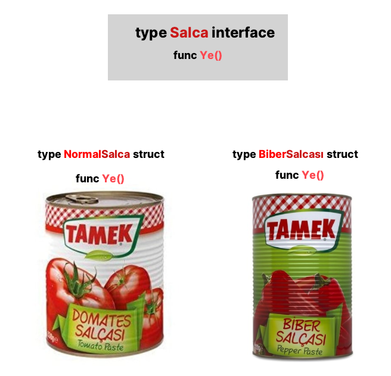

# Interface

**Interface** (arayüz), nesne yönelimli programlama dilllerine aşina olmayan kişiler için biraz zor anlaşılan bir konu. Aslında buraya kadar anlattığım konularda mantık olarak anlamadığınız bir yer yoksa interface konusunu anlayabileceğinizi düşünüyorum. Önemli olan güzelce anlatabilmem. O yüzden gelecekten gelen ben, bu eskimiş ve yeni başlayanlar için pek anlaşılabilir olmayan bu konunun anlatımına yeniden bir el atıyorum.

Öncelikle interface'in Golang üzerindeki tanımı: Interface, farklı tasarlanmış ama sonuç olarak aynı amaç için kullanılan structlar için bir standart tanımlamasıdır. (Size şuan ne kadar geçti bu tanım bilemem 🤔)

Tamamen gerçek hayattan bir örnek ile benzetme yapayım. Bu yazıyı yazarken biraz karnım aç olduğu için tamamen şuan aklıma gelen gıda üzerinden bir örnek ile ilerleyeceğim.

Bizim bir tane normal bir konserve salçamız ve bir tane da biber salçamız olduğunu düşünün.

Aşağıdaki resimde daha önce tarihte örneği görülmemiş bir şema ile karşılaşacaksınız. Lütfen hazırlıklı olun.



Yukarıdaki ilginç şemadan çıkarmamız gereken ders, altta bulunana konserve salçaların ikisinde de `ye()` isminde fonksiyonları var. Bunları struct fonkisyon olarak eklenmiş gibi düşünün.

Yukarıdaki `Salça` interface'imizin ise ye() isminde bir fonksiyon tanımlaması var. Aslında burada struct fonksiyonlar gibi bir fonksiyon tanımlamıyoruz. Burada anlatılmak istenen olay, `salça` interface'i içerisinde bir salçanın salça olabilmesi için `ye()` fonksiyonunun olması gerekir diyoruz. Yani interface'imiz bir bakıma `Türk Standartları Enstitüsü` gibi birşey :relaxed: Yani biz bir salçalı ekmek yiyeceğimiz zaman `Salça` interface'imize bakıyoruz ve görüyoruz ki TSE tarafından belirlenmiş olarak `ye()` fonksiyonu bulunan bir salça almamız gerekiyor. Şemadaki 2 çeşit salçanın da `ye()` fonksiyonu olduğu için ikisi de `salça` interface'inde belirlenmiş standart(lar)a uygun oluyor.

Şimdi bunun için bir örnek görelim.

```go
type biberSalçası struct {
	//buraya birşey yazmamız gerekli değil
}

func (s biberSalçası) Ye() {
	fmt.Println("Biber salçası yenildi")
}

type domatesSalçası struct {
	//buraya birşey yazmamız gerekli değil
}

func (s domatesSalçası) Ye() {
	fmt.Println("Domates salçası yenildi")
}
```

Yukarıdaki 2 çeşit salça structı içinde `Ye()` struct fonksiyonları oluşturduk. Bu fonksiyonlar çeşidine göre komut satırına farklı çıktılar bastırıyor. Yani biz bu structlar üzerinden değişkenler oluşturup `Ye()` fonksiyonunu çalıştırabiliriz. Bir adım ilerleyelim.

```go
type Salça interface{
	Ye()
}
```

Yukarıda `Salça` isminde bir interface oluşturduk. Daha önceden oluşturduğumuz structlar bu interface'imizle uyumludur. Bunu nereden anladık, çünkü struclarımızın `Ye()` fonksiyonları var ve interface'imizde `Ye()` fonksiyonu olacak diye şart koşmuşuz. Main fonksiyonumuz ise aşağıdaki gibi olsun.

```go
func main() {
	biber := biberSalçası{}

	var salçam Salça
	salçam = &biber

	salçam.Ye()
}
```

Bu kısma dikkat edelim. biber isminde `biberSalçası` structından bir nesne oluşturduk. Sonrasında salçam isminde `Salça` interface'inden bir nesne oluşturduk.

5\. satırda ise `salçam` interface nesnesine biber structını atadık. Bu sayede `salçam` değişkeni üzerinden `biberSalçası` structının `Ye()` fonksiyonunu çalıştırabildik.

Programı çalıştırdığımızda aşağıdaki çıktıyı göreceğiz.

> Biber salçası yenildi

Gördüğünüz gibi `biberSalçasının` `Ye()` fonksiyonunu çalıştırdı. Yani interface'imiz burada `biberSalçası` olarak çalıştı. Bir küçük örnek daha görelim.

```go
func main() {
	biber := biberSalçası{}
	domates := domatesSalçası{}

	var salçam Salça

	salçam = &biber
	salçam.Ye()

	salçam = &domates
	salçam.Ye()
}
```

Yukarıdaki örneğimizde iki tür salça içinde bir değişken oluşturduk. Daha sonra interface'imiz için bir değişken oluşturduk.

Sonrasında interface değişkenimize `biberSalçasını` verip ekrana bastırdık, son olarak da interface değişkenimize `domatesSalçasını` verip ekrana bastık.

Sonuca baktığımızda iki farklı struct tipi içinde `Ye()` fonksiyonunda olan işlemleri gerçekleştirdi.

Çıktımız aşağıdaki gibi olacaktır.

> Biber salçası yenildi
>
> Domates salçası yenildi

Şuanki yaptıklarımızdan farklı bir kullanım şekli de görelim.

```go
func Ye(s Salça){
	s.Ye()
}

func main() {
	biber := biberSalçası{}
	domates := domatesSalçası{}

	Ye(biber)
	Ye(domates)
}
```

Yukarıdaki kodlarımız daha yukarıdaki kodlarımızın devamıdır. Sadece farklı bir kullanım şekli. `Ye()` isminde bir fonksiyon oluşturduk. Bu fonksiyonun ismini farklı birşey de yapabilirdik. Neyse, fonksiyonumuza baktığımızda `Salça` interface'si ve bu interface'in standartlarına uygun olan değikenleri parametre olarak alabiliyor. Bu gelen parametreyi de `s` değişkeni üzerinden nesnenin `Ye()` fonksiyonunu çağırıyor.

`Main` fonksiyonumuz içerisinden oluşturduğumuz nesleri `Salça` interface'inde belirtilen standartlara uygun olduğu için `Ye()` fonksiyonumuza parametre olarak verebildik.

Çıktımıza bakalım bir de.

> Biber salçası yenildi
>
> Domates salçası yenildi
