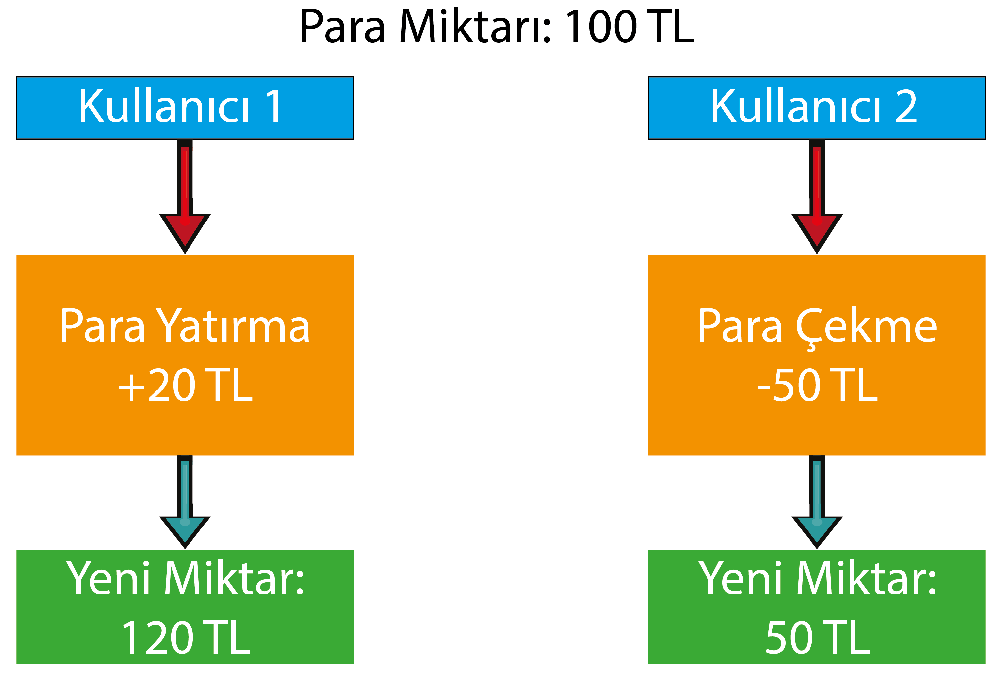

# Mutex ile Asenkron İşlem Sırası

Size konu başlığını şöyle açıklayayım. Örneğin bir banka uygulaması para çekme ve yatırma gibi özelliklere sahiptir. Programlama mantığında para yatırmak ve çekmek için şuanki para miktarını bilmemiz gerekir. Banka uygulamasının mantığı en basit derecede bu şekilde çalışır.

Banka hesabımızda asenkron işlem yapıldığını varsayalım. Yani bir hesaptan aynı anda birden fayda kullanıcı işlem yapıyor olsun.

Örneğin hesabımızda 100₺ olsun. Birinci kullanıcı 20₺ yatırsın. Aynı anda kullanıcı 50₺ çeksin. Bu iki kullanıcınında kullandığı program işlem yapmaya başladığında önce para miktarını alıyor. Daha sonra yapılacak işleme göre ya ekleme ya da çıkarma işlemi yapıyor. Fakat birden fazla kullanıcı aynı anda bu işlem yaparsa hesaptaki parada yanlışlık olacaktır.

Basit bir grafik ile inceleyelim.

İşlemlere aynı anda başlandığını varsayalım.



Bu işlemin sonuncunda hangi kullancının işlemi sonuncu olarak biterse para miktarı onun sonucu olur. Yani kullanıcı 2'nin işlemi kullanıcı 1'den sonra biterse yeni para miktarı 50₺ olur.

Bu gibi örneklerde asenkron işlemlere sıra verilmesi gerekir. Mutex tam olarak bu işi yapıyor. Bunun için bir Mutex nesnesi oluşturuyoruz. İşlemlerimizi bu nesne üzerinden yapıyoruz. Bu nesnede aynı anda sadece bir işlemi gerçekleştiriyor. Bu yüzden sıra işlemi sağlıyor. Önce başlayan asenkron işlem  ilk sırada oluyor. Tamamlanınca diğerine sıra geçiyor. Böyle düşündüğümüz zaman "bunun senkron programlamadan ne farkı var?" diyebilirsiniz. Farkı asenkron fonksiyonları içindeki istediğimiz kısımları senkron çalıştıramız.

Örnek bir para yatırma-çekme uygulaması yazalım. İşlemin sağlık çalışması için, para miktarıyla aynı anda sadece bir kişi işlem yapabilmelidir.

```go
package main

import (
	"fmt"
	"sync" // mutex'i kullanmak için
)
//global olarak mutex nesnesi oluşturalım.
var mt sync.Mutex


func paraÇek(bakiye *float64, çekilecekMiktar float64, wg *sync.WaitGroup) {
	/*
	* mt isimli mutex'i bu işlem yapılırken kilitliyoruz.
	* bu sayede mt mutex'ini başka işlemler kullanamıyor.
	*/
	mt.Lock()

	/*
	bu kısımda asenkron olmasını istemediğimiz işlemi yapalım.
	*/
	*bakiye -= 15
	fmt.Printf("Yeni Bakiye: %.2f\n", *bakiye)

	/*
	* diğer işlemlerinde kullanabilmesi için mutex'i tekrardan açalım.
	* mt mutex açılınca diğer asenkron işlemdeki mt mutex'i çalışmaya başlar. 
	*/
	mt.Unlock()
	fmt.Println("Çekme işlemi tamamlandı.")

	/*
	* waitgroup ile işlemin tamamlandığını belirttik.
	* böylece wg havuzu 2'den 1'e düştü
	*/
	wg.Done()
}

//bu fonksiyonda yukarıdaki ile aynı mantıkta
func paraYatır(bakiye *float64, yatırılacakMiktar float64, wg *sync.WaitGroup) {
	mt.Lock()
	*bakiye += 65
	fmt.Printf("Yeni Bakiye: %.2f\n", *bakiye)
	mt.Unlock()
	fmt.Println("Yatırma işlemi tamamlandı.")
	wg.Done()
}

func main() {

	/*
	* asenkron işlemlerimizin, ana iş parçacığında tamamlanmasını
	* beklemek için waitgroup nesnesi oluşturalım
	*/
	var wg sync.WaitGroup

	//2 fonksiyonu da bekleyeceğimiz için Add'e 2 yazalım
	wg.Add(2)

	//fonksiyonlarımızın kullancağı bakiye değişkenimiz
	var bakiye float64 = 100
	fmt.Printf("İlk Bakiye: %.2f\n", bakiye)
	
	/*
	* paraÇek ve paraYatır fonksiyonlarımızı aynı anda başlatıyoruz.
	* hangisi daha önce başlarsa mutex sırasına ilk o girer. bu esnada diğer
	* fonksiyon mutex'in açılmasını bekler.
	*/
	go paraÇek(&bakiye, 25, &wg)
	go paraYatır(&bakiye, 65, &wg)

	/*
	* ana iş parçacığı tamamlandığında asenkron çalışan fonksiyonları beklemez.
	* beklemediğinde de asenkron fonksiyonlar çalışmadan program sonlanır.
	* ana iş parçacığının asenkron işlemleri beklemesi için waitgroup sonucunun 0 olmasını bekleriz.
	* wg.Add(2) yazarak 2 adet wg.Done() fonksiyonu çalıştığında wg.Add(0) olur ve
	* wg.Wait() tamamlanır ve program başka işlemler yapılmıyor ise sonlanır.
	*/
	wg.Wait()
}
```

Çıktımız aşağıdaki gibi olacaktır.

> İlk Bakiye: 100.00  
> Yeni Bakiye: 165.00  
> Yatırma işlemi tamamlandı.  
> Yeni Bakiye: 150.00  
> Çekme işlemi tamamlandı.

Yukarıdaki çıktıya göre, `paraYatır()` fonksiyonu `paraÇek()` fonkisyonundan önce çalışmıştır.

