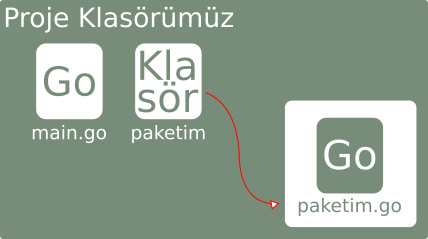

# Paket (Kütüphane) Yazmak

Bu bölümde Go üzerinde nasıl kendi paketimizi (kütüphanemizi) oluşturacağımıza bakacağız.

### Bir Paketin Özellikleri

* İçerisinde `.go` dosyaları bulunan bir klasördür.
* Diğer projeler tarafından içe aktarılabilir.
* Dışa aktarılabilen veya aktarılamayan veriler içerir.
* Açık kaynaktır.
* `main()` fonksiyonu içermez.
* `package main` değildir.

Paket oluştururken dikkat etmemiz gereken prensipler vardır. Bunlar şık ve basit kod yazımı, dışarıdan kullanımı basit, mümkün olduğunca diğer paketlere bağımsız olmasıdır. Bu prensiplere dikkat ederek daha iyi bir paket yazabilirsiniz.

### Proje Klasöründe Yerel Kütüphane Oluşturma

Öncelikle aşağıdaki gibi bir dosya düzenimiz olduğunu varsayalım.



Yukarıdaki gibi `paketim` klasörü içerisinde `paketim.go` dosyamız olsun.

`paketim.go` dosyamızın içi aşağıdaki gibi olsun.

```go
package paketim

import "fmt"

func Yaz() {
	fmt.Println("yazdım!")
}
```

`package paketim` ile paketimizin ismini belirledik. Bu isim paket klasörümüz ile aynı olmalıdır. Daha sonra projemizde kullanabilmemiz için dışa aktarılmış şekilde `Yaz()` fonksiyonu oluşturduk. Bu fonksiyonun ne işe yaradığı zaten belli.

`main.go` dosyamız ise aşağıdaki gibi olsun.

```go
package main

import p "./paketim"

func main() {
	p.Yaz()
}
```

`import p "./paketim"` yazarak özel paketimizin yerel konumunu belirterek, `p` lakabı (alias) ile çağırdık.

`Yaz()` fonksiyonumuzu ise `p.Yaz()` şeklinde kullandık.

### Git Sisteminde Kütüphane Paylaşımı

Oluşturduğumuz kütüphaneyi Github, Gitlab, Bitbucket vb. sitelerde barındırarak diğer geliştiricilerinde kütüphanelerinizden faydalanmasını sağlayabilirsiniz.

Bunun için kütüphanenizin isminde bir repo oluşturup, içerisinde Go dosyalarınızı yükleyin. Daha sonra `go get github.com/id/repoismi` şeklinde projenize import edebilirsiniz.
