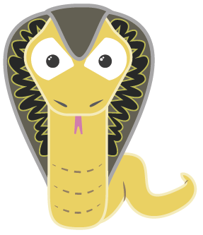

# Cobra CLI

<figure><figcaption><p>Cobra CLI logo</p></figcaption></figure>

Cobra, basit arayüzlü komut satırı uygulamaları oluşturmanız için güçlü bir pakettir. CLI uygulamanızı kolaylıkla oluşturabilmeniz için aynı zamanda oluşturucu bir cli aracıdır.

Özellikler:

* Kolay alt-komut (subcommand) yapısında cli uygulamaları: `app server` , `app fetch` gibi,
* Tamamen POSIX uyumlu flag'ler (kısa ve uzun versiyonları ile),
* İç içe alt-komutlar,
* Global, yerel ve cascading (basamaklı) flag'ler,
* `cobra init appname` ve `cobra add cmdname` gibi komutlarla kolayca yapı oluşturma,
* Akıllı öneriler (`app servr` ... did you mean `app server`?)
* Komutlar ve flag'ler için otomatik yardım oluşturma
* Otomatik help flag tanımlaması `-h` ve `--help`
* Otomatik shell auto-completion oluşturma (bash-zsh-fish-powershell)
* Otomatik manual sayfası oluşturma
* Komut alias'ları
* Kendi yardım ve kullanım bilgilerini tanımlama esnekliği

## Kurulumlar

### Paketi kurmak için;

`go get -u github.com/spf13/cobra@latest`

### CLI aracını kurmak için;

`go install github.com/spf13/cobra@latest`


## Basit Bir Başlangıç Yapalım

Proje klasörümüzü oluşturduktan sonra,

`cobra-cli` aracının çalışması için proje klasörümüzün içerisinde eğer `go modules` kurulmamışsa `go mod init <isim>` komutunu çalıştırmamız gerekiyor.

`cobra-cli init uygulamam` veya bulunduğunuz dizinde oluşturmak için `uygulamam` yerine `.` (nokta) kullanabilirsiniz.

Bu komuttan sonra aşağıdaki gibi klasör ve dosya yapısı oluşacaktır.


```
.
├── LICENSE
├── cmd
│   └── root.go
├── go.mod
├── go.sum
└── main.go

1 directory, 5 files
```


Oluşturulan yapıyı incelediğimizde, `main.go` dosyamız basitçe aşağıdaki gibi görünür.


```go
package main

import "cobra-cli-example/cmd"

func main() {
	cmd.Execute()
}
```


import kısmındaki `cobra-cli-example`, go module'daki belirlediğimiz isim olduğundan sizde farklı görünecektir. `main()` fonksiyonu içerisinde alt-paketimiz olan `cmd` içerisindeki `Execute()` fonksiyonunu çalıştırıyor. Varsayılan kullanımda tüm flag'ler ve sub-command'ler vs. bu fonksiyonun çalışmasıyla yüklenecek.

cmd klasörünün içerisine baktığımızda, burada `root.go` isimli dosyamızı görüyoruz. Bu dosyamızın içerisinde cli uygulamamız başlatıldığında herhangi bir komut girilmemiş ise gerçekleşecek işlemleri bulundurabiliriz.

Örnek olarak komut satırı kullanımında;

`./cobra-cli-example`

veya

`go run .`


`root.go` dosyasını inceleyelim.


```go
package cmd

import (
	"os"

	"github.com/spf13/cobra"
)


// rootCmd, uygulama alt-komutsuz şekilde çağırıldığında
//gerçekleşecekleri temsil eder.
var rootCmd = &cobra.Command{
	Use:   "cobra-cli-example",
	Short: "uygulamanın kısa bilgisi",
	Long: `uygulamanın uzun bilgilendirme metnini bu kısma girebilirsiniz.`,
}

// Execute fonksiyonu tüm komut ve alt-komutları
// uygulama çalıştırıldığında yüklenmesini sağlar
func Execute() {
	err := rootCmd.Execute()
	if err != nil {
		os.Exit(1)
	}
}

func init() {
	// init fonksiyonu içerisinde ise komuta bağlı olan
	// alt-komutlarını ve flag'lerini bağlayabilir ve bunlar
	// için özelleştirmelerde bulunabilirsiniz.
	rootCmd.Flags().BoolP("toggle", "t", false, "toggle için yardım mesajı")
}
```


Bu uygulamayı `go run .` komutu ile başlattığınızda, aşağıdaki gibi bir sonuç alırsınız.


```
uygulamanın uzun bilgilendirme metnini bu kısma girebilirsiniz.
```


Varsayılan olarak `rootCmd` altındaki `Long` içerisinde yazdığımız açıklama metni görünür.

Uygulamamız çalıştığında bir işlem gerçekleştirmek istiyorsak, aşağıdaki gibi yapabiliriz.

`root.go` dosyası içerisinde `rootRun` isminde bir fonsiyon oluşturalım.


```go
func rootRun(cmd *cobra.Command, args []string) {
	fmt.Println("Merhaba Dünya!")
}
```


Bu fonksiyonumuzun çalıştırılması için oluşturduğumuz `rootCmd` nesnesine ekleyelim.


```go
var rootCmd = &cobra.Command{
	Use:   "cobra-cli-example",
	Short: "uygulamanın kısa bilgisi",
	Long:  `uygulamanın uzun bilgilendirme metnini bu kısma girebilirsiniz.`,
	Run:   rootRun,
}
```


5\. satırda `Run` alanına çalıştırmak istediğimiz fonksiyonu yazdık.

Uygulamamızı başlattığımızda aşağıdaki gibi bir çıktı ile karşılaşacağız.


```
Merhaba Dünya!
```


Böylece `rootCmd` uzun bilgilendirme metnini görüntülemek yerine artık istediğimiz işlemi yapıyor.


Eğer bilgilendirme metnini veya yardım metinlerini görmek istersek, `-- help` veya `-h` flag'lerini kullanabiliriz.


```
uygulamanın uzun bilgilendirme metnini bu kısma girebilirsiniz.

Usage:
  cobra-cli-example [flags]

Flags:
  -h, --help     help for cobra-cli-example
  -t, --toggle   toggle için yardım mesajı

```


### Uygulamanın yüklenmesi

Oluşturduğumuz uygulamayı yüklemek için build edebilir veya `go install` komutu ile yükleyebilirsiniz.

`go install` ile yükledikten sonra komut bulunamıyorsa, `~/go/bin` klasörünü `path`'e eklemeyi deneyebilirsiniz.

### Bir komut ekleyelim

Komut eklemek için tekrardan `cobra-cli` aracından faydalanabiliriz. Bunun için;


```
gopher created at /xxxxxxx/cobra-cli-example
```


Bu komut sonrası `cmd` klasörümüzün içerisinde komuta verdiğimiz isim olan `gopher` isminde bir `go` dosyası oluşturulduğunuz göreceksiniz.

Bu dosyayı inceleyelim. Aşağıdaki kodlarda sadeleştirilmiş halini göreceksiniz.


```go
package cmd

import (
	"fmt"

	"github.com/spf13/cobra"
)

// gopherCmd, gopher komutunu temsil eder.
var gopherCmd = &cobra.Command{
	Use:   "gopher",
	Short: "gopher komutu için kısa tanımlama",
	Long: `gopher komutu için uzun tanımlama metnini buraya girebilirsiniz.`,
	Run: func(cmd *cobra.Command, args []string) {
		fmt.Println("gopher komutu çalıştı")
	},
}

func init() {
	// Bu kısımda gopher komutumuzun cli üzerinden çağrılabilmesi için
	// root komutumuza ekliyoruz.
	rootCmd.AddCommand(gopherCmd)
}
```


Yukarıdaki örnekte `run` fonksiyonunu direkt olarak `gopherCmd` içerisinde yazdık. Zaten varsayılan olarak oluşturulduğunda burada yazıyor. Kod düzenini sağlamak için eğer uzun satırlı bir fonksiyon olacaksa ayrı bir yerde yazılması tavsiye edilir.

Aşağıdaki komutla bu işlemi de deneyebiliriz.


```
gopher komutu çalıştı
```


### Alt-komut ekleme

Yukarıdaki gopher komutuna bir alt komut eklemek istersek, aşağıdaki yöntemi uygulamalıyız.

Öncelikle `cobra-cli` aracı üzerinden bir komut ekleyelim.


```
alt created at /xxxxxxxxx/cobra-cli-example
```


`cmd` içerisindeki `alt.go` dosyasında yapmamız gereken tek şey hangi komuta alt komut olarak vereceğimizi belirtmektir. Varsayılan olarak eklenen tüm komutlar `rootCmd`'ye eklenir. İstersek bu komutu `gopher` komutuna alt komut olarak ekleyebiliriz. Bunun için `alt.go` dosyasındaki `init()` fonksiyonuna bakabiliriz.


```go
rootCmd.AddCommand(altCmd) 
```


Bu bölümü aşağıdaki gibi değiştirelim.


```go
gopherCmd.AddCommand(altCmd)
```


Bu değişiklikleri gözlemlemek için aşağıdaki komutu deneyebiliriz.


```
alt called
```


### Argümanları okuma

Argümanlar komutların yanına girilen, `string` olarak okunabilen değerlerdir.


Argümanları okuyabilmek için kullanacağımız komutun bir alt-komutu olmaması gerekir.


Örnek olarak `root` komut üzerinden bir argüman okuyalım.


```go
func rootRun(cmd *cobra.Command, args []string) {
	fmt.Println("Merhaba", args[0], "!")
}
```


Bu yapıya göre aşağıdak şekilde uygulamamızı deneyelim.


```
Merhaba Kaan !
```


Eğer `root` komutuna bir alt-komut ekli olsaydı, `Kaan` isimli bir komutun olmadığını gösteren bir hata alacaktık.


```
Error: unknown command "Kaan" for "cobra-cli-example"
Run 'cobra-cli-example --help' for usage.
exit status 1
```


Bu yüzden argümanlarımızı sadece alt-komut içermeyen komutlar üzerinden okumalıyız.

### Bir flag ekleyelim

Flag'leri kullanarak cli uygulamamızı kullanan kullanıcılara seçenekler sunabiliriz. Bir flag eklemek için birden fazla yöntem vardır. İlke olarak flag'imizde ayarlanacak değeri kaydetmek için bir değişken oluşturalım ve aşağıdaki gibi bir yapı kuralım. Bu flag'imizi `root` komutuna ekleyeceğiz.

Diğer alanlar üzerinden de kullanabilmemiz için değişkenimizi global olarak tanımlayalım.


```go
var isim string
```


Flag'i eklemek için `root.go` içerisinde `init()` fonksiyonuna ekleme yapalım.


```go
func init() {
	rootCmd.Flags().StringVarP(&isim, "isim", "i", "Ahmet", "--isim <ahmet> veya -i <ahmet>")
}
```


`StringVarP()` fonksiyonu ile pointer kullanarak oluşturduğumuz değişkenin adresine komut satırından aldığımız değeri atayabiliriz. Bu flag'i aşağıdaki gibi kullanabiliriz.

`rootCmd`'nin `Run` alanına bağladığımız fonksiyon içerisinde kullanalım.


```go
func rootRun(cmd *cobra.Command, args []string) {
	fmt.Println("Merhaba",isim,"!")
}
```


Aşağıdaki komut ile uygulamamızı deneyebiliriz.


```
Merhaba Kaan !
```


Yukarıdakinden farklı olarak başka kullanım şekilleri de vardır.

`go run . -i Kaan`

`go run . --isim=Kaan`

`go run . --i=Kaan`

Aslında gördüğünüz gibi tamamen posix bir cli uygulaması olarak çalışıyor.

Eğer `isim` flag'ini belirtmeden başlatılırsa varsayılan değer olarak verdiğimiz "Ahmet" kullanılacaktır.

Flag'i ekledikten sonra yardım komutunu çalıştırdığımızda aşağıdaki gibi bir çıktı alırız.


```
uygulamanın uzun bilgilendirme metnini bu kısma girebilirsiniz.

Usage:
  cobra-cli-example [flags]
  cobra-cli-example [command]

Available Commands:
  completion  Generate the autocompletion script for the specified shell
  gopher      gopher komutu için kısa tanımlama
  help        Help about any command

Flags:
  -h, --help          help for cobra-cli-example
  -i, --isim string   --isim <ahmet> veya -i <ahmet> (default "Ahmet")

Use "cobra-cli-example [command] --help" for more information about a command.
```


Yukarıda gördüğümüz gibi her komut veya flag eklediğimizde bilgilendirmesi yardım alanında görünür.

Eğer kullanacağımız flag sadece uzun flag kullanımı içerecekse `StringVar()` fonksiyonunu kullanabiliriz.

```go
rootCmd.Flags().StringVar(&isim,"isim","Ahmet","--isim <ahmet> veya -i <ahmet>")
```

Eğer flag'in bir değer dönmesini istersek, yani işaretçisiz kullanımı için, `String()` fonksiyonunu kullanabiliriz.

```go
isim := rootCmd.Flags().String("isim", "Ahmet", "--isim <ahmet> veya -i <ahmet>")
```

Değer dönme ile beraber uzun flag ile kullanmak istersek, `StringP()` fonksiyonunu kullanabiliriz.

```go
isim := rootCmd.Flags().StringP("isim", "i", "Ahmet", "--isim <ahmet> veya -i <ahmet>")
```

Yukarıda gördüğümüz yöntemler ile daha farklı veri tipleri için kullanım senaryoları oluşturabiliriz.

Sadece fonksiyon ismindeki `String` yerine kullanmak istediğiniz veri tipini yazmanız yeterlidir.

### Kalıcı (Persistent) flag ekleme

Kalıcı flag'ler üst komutlara eklendiğinde alt komutlar üzerinde de kullanılabilir.

Aşağıdaki örnekte kalıcı flag'imizi root komuta ekleyip gopher komut üzerinde de kullanmayı göreceğiz.


```go
rootCmd.PersistentFlags().StringVarP(&isim, "isim", "i", "Ahmet", "--isim <ahmet> veya -i <ahmet>")
```


Yukarıdaki örnekte flag'in alt komutlar üzerinde de çalışması için, diğer örneklerin aksine `Flags()` yerine `PersistentFlags()` fonksiyonunu kullandık. Uygulamamızı deneyelim.


```
gopher komutu çalıştı
```


Böylelikle `isim` flag'inden gelen değeri de okuyabildik. Bu yöntem dışında yapıldığında, flag'in geçersiz olduğuna dair hata verecektir.

### Flag'i zorunlu kılma

Bir komut altındaki bir flag'i zorunlu kılmak için `MarkFlagRequired()` fonksiyonunu kullanabiliriz.


```go
rootCmd.Flags().StringVar(&isim, "isim", "Ahmet", "--isim <ahmet> veya -i <ahmet>")
err := rootCmd.MarkFlagRequired("isim")
if err != nil {
    log.Fatalln(err)
}
```


Uygulamamızı `isim` flag'ini girmeden başlattığımızda aşağıdaki gibi bir hata alacağız.


```
Error: required flag(s) "isim" not set
```


### Versiyon belirtme

Uygulamanın `--version` flag'i ile versiyonunun gösterilmesi için, `rootCmd` nesnesi tanımlanırken `Version` alanı içerisine versiyonu bildiren bir numara yazabiliriz. Örnek olarak:


```go
var rootCmd = &cobra.Command{
	Use:     "cobra-cli-example",
	Short:   "uygulamanın kısa bilgisi",
	Long:    `uygulamanın uzun bilgilendirme metnini bu kısma girebilirsiniz.`,
	Run:     rootRun,
	Version: "0.1",
}
```


6\. satırda uygulamanın versiyonunu belirttik. Uygulama üzerinde deneyelim.


```
cobra-cli-example version 0.1
```


### Kullanımdan kaldırılan (Deprecated) komutlar

Uygulamamızda kullanılan bir alt komutu, yani `root` olmayan diğer komutları, kaldırmak yerine bu komutların eskide kaldığını kullancılara bildirebiliriz. Bunun için kullanımdan kaldıracağımız komutu aşağıdaki gibi bir ekleme yapabiliriz.


```go
var altCmd = &cobra.Command{
	Use:   "alt",
	Short: "kısa tanım",
	Long:  `uzun tanım`,
	Run: func(cmd *cobra.Command, args []string) {
		fmt.Println("alt çalıştırıldı")
	},
	Deprecated: "[altyeni] komutunu kullanın",
}
```


`Depracated` alanına string tipinde bir açıklama yapabiliriz. `Deprecated` komutlar çalışmaya devam eder. Uygulamamızı deneyelim.


```
Command "alt" is deprecated, [altyeni] komutunu kullanın
alt çalıştırıldı
```

