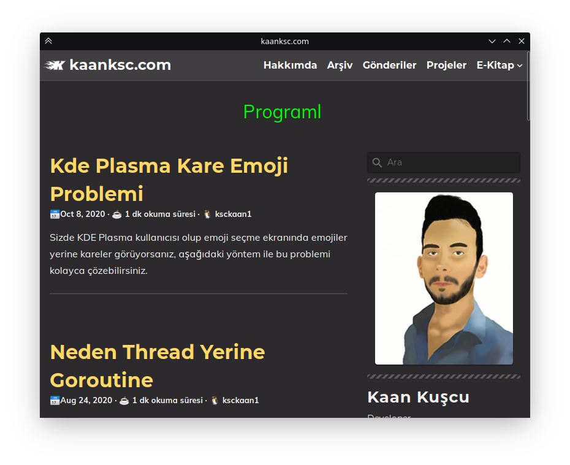
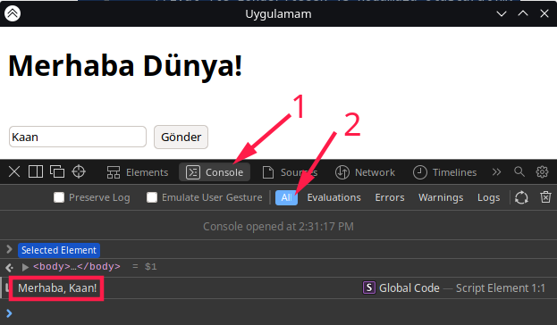

# WebView

**webview** kütüphanesine giriş yapmadan önce bahsetmek istediğim birkaç konu var.  
Daha önce aramızda **electron.js**‘i duyanlar olmuştur. Hani şu Visual Studio Code, Skype, Atom, Discord ve Slack gibi başarılı uygulamaların yazılmış olduğu Javascript kütüphanesinden bahsediyorum. Electron.js ile yazılan uygulamalar **HTML**, **CSS** ve **Javascript**‘in gücüyle kaliteli bir grafiksel kullanıcı arayüzüne ulaşabiliyor. Eğer bir Web Developer’sanız kolayca masaüstü uygulaması yazabiliyorsunuz. Ama Electron.js ile yazılmış uygulamaların kötü yanları da var tabi. Uygulama boyutu bunlardan en sıkıntılı olanı. En basit bir uygulamanın boyutu 150 Megabyte olabiliyor. Bir de **electron-packager** yardımı ile uygulama build edilirken uzun süre bekliyorsunuz.  
Şimdi gelelim bizi bu olaylardan kurtaracak olan gözümün nuru Golang Kütüphanesi olan **webview** kütüphanesine ♥

**webview** kütüphanesi **zserge** arkadaşımız tarafından yazılmış olan, web sayfaları tasarlayıp programa dönüştürebildiğimiz, backend kısmını Golang rahatlığında yazdığımız bir kütüphane \(veya paket\)dir. 


zserge/webview repo'su webview/webview'a taşınmıştır.


Build işlemi sonrası aslında elimizde bir internet tarayıcısı olmuş oluyor. Bu tarayıcı üzerinden hazırlamış olduğumuz web sayfası görüntüleniyor. Frontend ve Backend arasındaki iletişimi ise **Bind** ile sağlıyoruz. Bu özelliği birazdan kodlar içerisinde açıklayacağım.

Sadece **Windows**, **GNU/Linux** ve **macOS** için uygulama geliştirebiliyoruz.  
GNU/Linux üzerinde **gtk-webkit2**, macOS üzerinde **Cocoa/Webkit** ve Windows üzerinde **Edge** alt yapısını kullanıyor. Linux üzerinde çalışması için, gtk-webkit2 paketini yüklemeyi unutmayın. Bu detaylara bakacak olursak, Windows üzerinde çalışırken Edge Browser’ı kullanacak. macOS ve GNU/Linux üzerinde ise Chrome benzeri bir altyapı kullanacak. Bu durumda GNU/Linux ve macOS için geliştirmek daha mantıklı çünkü daha fazla görsel efekt imkanı var olacaktır. Örnek: CSS3’teki **-webkit-** etiketi…  
Gelelim kütüphanenin kurulumuna. Aşağıdaki komut ile kütüphanemizi indiriyoruz.

> go get github.com/webview/webview


Kütüphanemizi kurduğumuza göre ufak bir örnek görelim. Daha sonra detaylı örnekler göstereceğim.


```go
package main

//webview paketimizi içe aktaralım
import "github.com/webview/webview"

func main() {
	//debug değişkeninde debug modu açıyoruz.
	debug := true
	
	//yeni webview nesnesi oluşturduk.
	pencere := webview.New(debug)
	
	//main fonksiyonunun sonunda pencerenin sonlanmasını
	//istedik.
	defer pencere.Destroy()
	
	//pencere başlığımızı belirttik.
	pencere.SetTitle("kaanksc.com")
	
	//penceremizin boyutunu belirttik.
	//(genişlik, uzunluk)
	pencere.SetSize(800, 600, webview.HintNone)
	//webview.HintNone ile normal bir pencere oluşturduk.
	
	//penceremizin yükleyeceği adresi belirtelim.
	pencere.Navigate("https://kaanksc.com")
	
	//son olarak penceremizi başlatalım.
	pencere.Run()
}
```




Yukarıdaki gibi basit bir yöntem ile bir **gui** program oluşturabiliyorsunuz. Seviyeyi biraz yükseltelim ve sonraki örneğimize geçelim.


```go
package main

import (
	"fmt"
	"net/http"

	"github.com/webview/webview"
)

//anasayfayı yakalaması için bir yakalayıcı oluşturuyoruz.
func handler(w http.ResponseWriter, r *http.Request) {
	//anasayfada gösterilecek metnimiz.
	fmt.Fprintf(w, "Uygulamaya hoşgeldiniz!")
}

//sunucu oluşturan fonksiyonumuz.
func serverOlustur() {
	// anasayfanın handler fonksiyonu ile çalışmasını.
	//istiyoruz
	http.HandleFunc("/", handler)

	//sunucumuzun koşacağı portu belirtiyoruz.
	http.ListenAndServe(":5555", nil)
}
func main() {
	//webview penceremize eşzamanlı olarak sunucunun
	//koşturulmasını istiyoruz.
	go serverOlustur()

	//webview nesnesi oluşturuyoruz.
	pencere := webview.New(true)
	// New fonksiyonundaki true ifadesi debug modunda
	//çalışmasını sağlıyor. Sayfaya sağ tıklayarak
	//görebilirsiniz.

	//main fonksiyonun son işlemi olarak webview
	//penceresinin kaldırılmasını istiyoruz.
	defer pencere.Destroy()

	//penceremizin başlığını belirtiyoruz.
	pencere.SetTitle("Uygulamam")

	//penceremizin boyutunu belirtiyoruz.
	pencere.SetSize(400, 300, webview.HintNone)

	//hangi adresi yükleyeceğini belirtiyoruz.
	pencere.Navigate("http://localhost:5555")

	//son olarak penceremizi başlatıyoruz.
	pencere.Run()
}

```


Hemen açıklamasını yapayım. Kendi sunucumuzu oluşturmak için **“net/http”** kütüphanesini ekledik. **serverOlustur\(\)** fonksiyonunda klasik web server oluşturmak için gerekli kodları yazdık. Görüntülenecek içeriği **handler\(\)** fonksiyonunda belirttik.  
**main\(\)** fonksiyonu içerisindeki kodlarımıza geçelim. **serverOlustur\(\)** fonksiyonunu **Goroutine** ile yazmazsak web server ayağa kaldırıldığında \(açıldığında\) kapanana kadar alt taraftaki webview kodlarının çalışmasına sıra gelmez. Başına **go** ekleyerek aynı anda server’ın oluşturulmasına ve diğer kodların çalışmasını sağlıyoruz. **webview** kodlarımızda ise oluşturduğumuz web server’ın bilgilerini ve pencere ayarlarını giriyoruz.  
Biraz değişiklikler ile istediğimiz bir klasörü göstermeye ayarlayabiliriz.

Projemizin yapısı aşağıdaki gibi olsun.


```bash
.
├── klasor
│   └── index.html
└── main.go
```


**index.html** dosyamız aşağıdaki gibi olsun.


```markup
<!DOCTYPE html>
<html lang="tr">
<head>
    <meta charset="UTF-8">
    <title>Bu kısma aslında gerek yok</title>
</head>
<body>
    <h1>Merhaba Dünya!</h1>
</body>
</html>
```


**main.go** dosyamız ise aşağıdaki gibi olsun.


```go
package main

import (
	"net/http"

	"github.com/webview/webview"
)

//sunucu başlatan fonksiyonumuz
//aslında bunu main fonksiyonuna da
// "go http.ListenAndServe(":5555", nil)"
//şeklinde yazabilirsiniz.
func serverOlustur() {
	//dinlecek portu belirttik (5555)
	http.ListenAndServe(":5555", nil)
}
func main() {
	//Sunucumuzun hangi klasörden oluşacağını
	//belirtiyoruz. (klasor isimli klasörümüzden)
	klasor := http.FileServer(http.Dir("klasor/"))

	//anasayfayı klasor'e bağlayalım.
	http.Handle("/", http.StripPrefix("/", klasor))

	//eşzamanlı olarak sunucuyu başlatalım.
	go serverOlustur()

	//debug açık şekilde webview nesnesi oluşturalım.
	pencere := webview.New(true)

	//pencere başlığını girelim.
	pencere.SetTitle("Uygulamam")

	//pencere boyutunu ve normal pencere olacağını belirtelim.
	pencere.SetSize(600, 400, webview.HintNone)

	//Yukarıda başlattığımız sunucunun adresini girelim.
	pencere.Navigate("http://localhost:5555")

	//penceremizi başlatalım.
	pencere.Run()
}
```


Sıra geldi Backend \(Golang\) ve Frontend \(Javascript\) arasındaki iletişimi sağlamaya. Aşağıdaki işlemleri yukarıdaki klasör yapısında göre yapacağız. Yani bu şekilde:


```bash
.
├── klasor
│   └── index.html
└── main.go
```


## **Frontend’den Backend’e Veri Gönderme \(JavaScript ===&gt; Go\)**

Bu işlemi gerçekleştirebilmemiz için webview tarayıcısının frontend’deki sinyalleri dinlemesi gerekir. Golang tarafından dinlemek için **Bind\(\)** fonksiyonunu kullanıyoruz.

Örnek bir **main.go** dosyası oluşturalım.


```go
package main

import (
	"fmt"
	"net/http"

	"github.com/webview/webview"
)

func serverOlustur() {
	http.ListenAndServe(":5555", nil)
}
func main() {
	klasor := http.FileServer(http.Dir("klasor/"))
	http.Handle("/", http.StripPrefix("/", klasor))
	go serverOlustur()
	pencere := webview.New(true)
	pencere.SetTitle("Uygulamam")
	pencere.SetSize(600, 400, webview.HintNone)
	pencere.Navigate("http://localhost:5555")

	//Bind fonksiyonu ile dinleyici oluşturduk
	pencere.Bind("merhaba", func(isim string) {
		//Javascript'teki merhaba fonksiyonunu dinliyoruz.
		//Javascript'teki bu fonksiyona string bir değer girilecek.
		//Bu değeri de aşağıdaki gibi ekrana bastıracağız.
		fmt.Println("merhaba", isim)
	})
	pencere.Run()
}
```


`Bind()` fonksiyonunu `pencere.Run()`'dan önce yazmalıyız. Eğer sonra yazarsak, çalışma zamanı `Run()` fonksiyonu kapatılmadan `Bind()` fonksiyonuna gelmeyeceği için yazmamızın bir mantığı olmaz.

Sıra geldi websayfamızdaki kodları yazmaya.

klasor klasörümüzün içerisine **uygulama.js** dosyası oluşturalım.


```bash
.
├── klasor
│   ├── index.html
│   └── uygulama.js << burada
└── main.go
```


**index.html** dosyamıza ise bir yazı kutusu ve buton ekleyelim.

Ek olarak da **uygulama.js** dosyamızı html etiketi olarak ekleyelim.


```markup
<!DOCTYPE html>
<html lang="tr">
<head>
    <meta charset="UTF-8">
    <title>Bu kısma aslında gerek yok</title>
</head>
<body>
    <h1>Merhaba Dünya!</h1><br>
    <input type="text" id="isim">
    <button id="gonder">Gönder</button>
    <script src="./uygulama.js"></script>
</body>
</html>
```


Oluşturduğumuz HTML elementlerine id'ler vererek, bunları Javascript'te kullanacağız.

**uygulama.js** dosyamızun içeriği ise aşağıdaki gibi olsun.


```javascript
var yaziKutusu = document.querySelector("#isim")
//yazı kutusunun id'sini belirttik

var gonderButonu = document.querySelector("#gonder")
//Gönder butonunun id'sini belirttik

//Gönder butonuna tıklandığı zaman gerçekleşecek olaylar
gonderButonu.addEventListener("click",() => {
    //yazı kutusunun içindeki değeri isim değişkeni olarak belirledik.
    var isim = yaziKutusu.value;
    //merhaba fonksiyonuna isim değişkeninin değerini yolladık.
    merhaba(isim)
    //Farkettiyseniz javascript tarafında merhaba adında bir fonksiyon
    //oluşturmadık. Normalde tarayıcı buna hata verecektir.
    //Ama biz golang tarafındaki webview'e merhaba fonksiyonunu bildirdik
    //ve dinleyici olarak tanıttık. 
})
```


Bu işlemler sonucunda uygulamamızı projemizin ana dizinindeyken `go run .` şeklinde başlatalım.

**Yazı kutusu**na isim girip **Gönder** butonuna baştığımızda konsol tarafında `merhaba isim` şeklinde bir çıktı görürüz.

## **Backend’den Frontend’e Veri Gönderme \(Go ===&gt; JavaScript\)**

Aslında burada yapacağımız olay bir JavaScript kodu çalıştırmak veya tetiklemek de denebilir. Tıpkı Developer Console'dan yaptığımız gibi..

Bu işlem için `Eval()` fonksiyonundan faydalanıyoruz. Örnek için yukarıdaki kodlarımıza devam edelim.

`merhaba` fonksiyonunu dinliyoruz demiştik. `Bind()` içerisinde komut satırına  isim bastırmak yerine JavaScript konsoluna ismi bastıralım.

`Bind()` fonksiyonumuzun içeriği şöyle olsun.

```go
pencere.Bind("merhaba", func(isim string) {
    //Eval ile gönderilecek js kodumuzu oluşturalım.
    jsKodumuz := fmt.Sprintf("console.log('Merhaba, %s!')", isim)
    //isim değişkeni %s yerinde gösterilecek.
    pencere.Eval(jsKodumuz)
})
```

Uygulamamızı çalıştırıp yazı kutusuna bir isim girdiğimizde Komut satırından şöyle bir çıktı alabiliriz:

> [http://localhost:5555/:1:12](http://localhost:5555/:1:12): CONSOLE LOG Merhaba, Kaan!

İsterseniz Webview içerisindeki Developer Tool ile de bakabiliriz.

Sayfaya sağ tıklayalım ve Inspect Element'e tıklayalım. Açılan bölümde **Console** sekmesine geçelim. All şeçeneğinin şeçili olduğundan emin olalım. Ve işte! log çıktımızın burada.



Bu işlemler ile kolay bir şekilde Backend-Frontend arası iletişimi sağlayabilirsiniz.

## Golang ile Webview'a Asenkron Müdahale Etme

Go tarafında asenkron işlemler için **Goroutine**'leri kullandığımızı belirtmiştik. Backend tarafında zaman alan bir işlemi goroutine ile asenkron bir işlem parçacığı haline getirmezsek. İşlem tamamlanana kadar webview penceremiz yanıt vermez. Yani herhangi bir şeye tıklayamayız. Bu yüzden uzun sürecek arkaplan işlemlerini **Webview**'e aseknron şekilde çalıştırmamız gerekir.

Örnek bir `Bind()` fonksiyonunda aseknron bir işlemi inceleyelim.

```go
pencere.Bind("merhaba", func(isim string) {
		//asenkron çalışan bir anonim fonksiyon oluşturalım
		go func(){
			//3 saniye beklesin
			time.Sleep(3*time.Second)
			//ve ekrana JavaScript tarafından gelen
			//isim değişkenini bastırsın.
			fmt.Println(isim)
		}()
})
```

Yukarıdaki örnekte JavaScript tarafından çalıştırılacak merhaba fonksiyonunu dinliyoruz. Bu fonksiyon bize string tipinde bir değer iletiyor. Asenkron olarak anonim bir fonksiyon oluşturuyoruz ve içeriğinde 3 saniye beklemesini istiyoruz. Son olarak ekrana isim değişkenindeki değeri bastırıyoruz.

Eğer bu kodları asenkron olarak çalıştırmasaydık, Webview penceremiz 3 saniye boyunca yaptığımız hiçbir işleme tepki vermeyecekti.

Şimdi buraya kadar karışık bir olay yok aslında. Asıl asenkron mantığı 3 saniye bekleyip çıktımızı JavaScript konsoluna bastırmak olacaktır. Aralarındaki asenkron olayı bu şekilde sağlancaktır.

Normalde asenkron iki işlemin birinden diğerine ait olan bir işlemi yapmak için işaretçileri _\(pointer\)_ kullanabiliriz. Fakat Webview nesnesine bir işaretçi atayamayız. Çünkü webview ile oluşturulan nesnemiz bir interface'tir.

Örnek bir deneme girişimi 😀


```go
package main

import (
	"fmt"
	"net/http"
	"time"

	"github.com/webview/webview"
)

func serverOlustur() {
	http.ListenAndServe(":5555", nil)
}
func main() {
	klasor := http.FileServer(http.Dir("klasor/"))
	http.Handle("/", http.StripPrefix("/", klasor))
	go serverOlustur()
	pencere := webview.New(true)
	pencere.SetTitle("Uygulamam")
	pencere.SetSize(600, 400, webview.HintNone)
	pencere.Navigate("http://localhost:5555")

	pencere.Bind("merhaba", func(isim string) {
		//fonksiyonumuzu asenkron olarak başlatıyoruz
		go fonksiyonumuz(&pencere, isim)
		//parametre olarak pencere nesnesinin adresini verdik
		//aynı şekilde isim değişkenini de
	})
	pencere.Run()
}

func fonksiyonumuz(p *webview.WebView, isim string) {
	//3 saniye beklemesini istedik
	time.Sleep(3 * time.Second)
	//Eval ile gönderilecek JS kodumuzu hazırlayalım
	jsKodumuz := fmt.Sprintf("alert('%s')", isim)

	//İşte geldik Zurnanın zırt dediği yere (kullandığım deyime takılmayın 😀)
	p.Eval(jsKodumuz)
	//Bu kısımda böyle bir kullanım yapamayacağımızı söylüyor olacak.
}
```



Şuana kadar gösterdiğim şeyler bir yanlış yapmayın diyeydi. Yukarıdaki yöntemi doğru değildir. Doğrusu `Dispatch()` fonksiyonunu kullanmaktır. Go kodlarımızın tamamını görecek şekilde bir örnek verelim. Örnek kullanımı:


```go
package main

import (
	"fmt"
	"net/http"
	"time"

	"github.com/webview/webview"
)

func serverOlustur() {
	http.ListenAndServe(":5555", nil)
}
func main() {
	klasor := http.FileServer(http.Dir("klasor/"))
	http.Handle("/", http.StripPrefix("/", klasor))
	go serverOlustur()
	pencere := webview.New(true)
	pencere.SetTitle("Uygulamam")
	pencere.SetSize(600, 400, webview.HintNone)
	pencere.Navigate("http://localhost:5555")

	pencere.Bind("merhaba", func(isim string) {
		//fonksiyonumuzu asenkron olarak başlatıyoruz
		go fonksiyonumuz(pencere, isim)
		//parametre olarak pencere nesnesini & olmadan verdik
	})
	pencere.Run()
}

func fonksiyonumuz(p webview.WebView, isim string) {
	//3 saniye beklemesini istedik
	time.Sleep(3 * time.Second)
	//Eval ile gönderilecek JS kodumuzu hazırlayalım
	jsKodumuz := fmt.Sprintf("alert('%s')", isim)

	//Dispatch fonksiyonu ile ana iş parçacığındaki webview
	//nesnesi ile işlem yapabiliriz.
	p.Dispatch(func() {
		p.Eval(jsKodumuz)
	})
}
```


## Webview Kütüphanesindeki Diğer Fonksiyonlar

### Destroy\(\)

Webview penceremizi sonlandırır.

```go
pencere.Destroy()
```

### Terminate\(\)

Pencerenin çalışmasını keser.

```go
pencere.Terminate()
```

### Eval\(\)

Pencerede JavaScript kodu çalıştırmamızı sağlar.

```go
pencere.Eval("alert('Merhaba!')")
```

### Init\(\)

Pencereye JavaScript kodu iliştirir. `Eval()` fonksiyonundan farkı ise sayfa değişse bile JavaScript kodu sayfada kalır. `Eval()` ile bir kere mahsus JavaScript kodu çalıştırılır. `Init()` fonksiyonunda sayfa yenilenince bile kod çalışırır.

```go
pencere.Init("alert('Merhaba!')")
```

### Navigate\(\)

Webview penceresinin belirtilen adresi yüklemesini sağlar.

```go
pencere.Navigate("https://www.google.com.tr")
```

### Run\(\)

Pencereyi başlatır.

```go
pencere.Run()
```

### SetSize\(\)

Pencerenin boyutunu ve etkileşimini ayarlar.

```go
//Genişlik, Uzunluk, Etkileşim
pencere.SetSize(800, 600, webview.HintNone)
//webview.HintNone ile normal,
//webview.HintFixed ile boyutu değiştirilemeyen,
//webview.HintMax ile en fazla solundaki büyüklükte,
//webview.HintMin ile en az solundaki küçüklükte
//bir pencere oluşturabiliriz.
```

### SetTitle\(\)

Pencerenin başlığını değiştirmemizi sağlar.

```go
pencere.SetTitle("Uygulama Başlığım")
```


