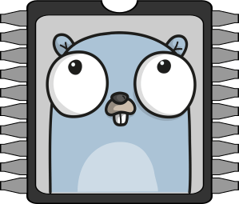

# Tinygo ile Küçük Yerler için Golang



Tinygo, Golang kodları ile mikro-denetleyicilere program yazmamızı sağlayan bir derleyicidir.

Aynı zamanda yazdığımız kodları mikro-denetleyicinin beynine flash eder. Flash etme kelimesinden kastım, beyne çalışacak kodları yazdırmaktır.



Gobot ile Arduino Yanıp-Sönen LED Yapımı konusunda bahsettiğim. Gobot paketinden farkı, Gobot Firmata yazılımını Arduino’ya gömdükten sonra Arduino’ya çalıştırılabilir komutlar yolluyor. Yani kodlarımızı Arduino içine gömmediğinden, sadece Arduino USB veya TCP ile bağlı olduğundan çalışıyor.

Fakat Tinygo, Golang kodlarımızı Arduino’nun içerisine gömüyor. Bu sebeble Arduino’nun kodlarımızı çalıştırması için sadece bir elektrik kaynağına bağlı olması yetiyor.

**Gelelim Kuruluma**

### GNU/Linux

Ubuntu/DebianBirinci Adım:  
`wget https://github.com/tinygo-org/tinygo/releases/download/v0.9.0/tinygo_0.9.0_amd64.deb`  
İkinci Adım:  
`sudo dpkg -i tinygo_0.9.0_amd64.deb`  
Üçüncü Adım:  
`export PATH=$PATH:/usr/local/tinygo/bin`RaspBerry PiBirinci Adım:  
`wget https://github.com/tinygo-org/tinygo/releases/download/v0.9.0/tinygo_0.9.0_armhf.deb`  
İkinci Adım:  
`sudo dpkg -i tinygo_0.9.0_armhf.deb`  
Üçüncü Adım:  
`export PATH=$PATH:/usr/local/tinygo/bin`Arch LinuxAUR deposundan [tinygo-bin](https://aur.archlinux.org/packages/tinygo-bin/) olarak aratabilirsiniz.Fedora Linux`sudo dnf install tinygo`

### **Windows**

Öncelikle şuanda Windows üzerinde deneme aşamasında olduğunu söylemeliyim.

İlk olarak LLVM 8’i kurmalısınız.

[Buradan indirme sayfasına gidebilirsiniz.](http://releases.llvm.org/download.html#8.0.1)

LLVM 8 kurulumu esnasında “LLVM’yi ortam değişkenlerine ekle” seçeneğini seçmeyi unutmayın.

Daha sonra Tinygo arşiv dosyasını indirelim.

[Tinygo Arşiv Dosyası İndir](https://github.com/tinygo-org/tinygo/releases/download/v0.9.0/tinygo0.9.0.windows-amd64.zip)

Aşağıdaki komut ile Tinygo’yu kuralım.

`PowerShell Expand-Archive -Path "c:\Downloads\tinygo0.9.0.windows-amd64.zip" -DestinationPath "c:\tinygo"`

Aşağıdaki komut ile Tinygo’yu ortam değişkenlerine ekleyelim.

`set PATH=%PATH%;C:\tinygo\bin;`

### MacOS

İlk adım:

​`brew tap tinygo-org/tools`

İkinci Adım:

`brew install tinygo`

### Kurulum Sonrası

Kurulum işlemlerimiz tamamlandıktan sonra kontrol etme amaçlı komut satırına aşağıdaki komutları yazalım.

`tinygo version`

Kullandığınız işletim sistemine göre fark göstermekle birlikte aşapıdakine benzer bir çıktı alacaksınız.

`tinygo version 0.9.0 linux/amd64 (using go version go1.12.9)`

Bu işlemler sırasında elimde bulunan Arduino Uno kartı ile işlemler yapacağımız belirteyim. Diğer kartlar ile arasında çok bir işlem farkı bulunmamaktadır. Aynı veya benzer yollardan sizce bu işlemleri gerçekleştirebilirsiniz.

Öncelikle Arduino Uno kartımızın hangi USB portuna bağlı olduğunu bulalım.

Windows üzerinden **COM3** benzeri bir portta takılıdır. İnternet üzerinden detaylı araştırma yapabilirsiniz.

Unix-like sistemlerde \(Linux, MacOS\) ise genelde **/dev/ttyUSB** veya **/dev/ttyACM** portarından birinde takılı olabilir. Arduino’nun bağlı olduğu portu `ls /dev/ttyUSB*` komutu ile öğrenebilirsiniz.

Ben Arduino Uno kartımın **/dev/ttyUSB0** üzerinde olduğu için aşağıdaki işlemlerimi ona göre yapacağım. Kullandığım komutları kendi portunuza göre değiştirmeyi unutmayın.

Aşağıda Arduino UNO üzerindeki Built-In LED’i saniyede bir yanıp-söndürmeye yarayan Golang kodları yer alıyor.

```go
package main

import (
	"machine"
	"time"
)

func main() {
	led := machine.LED
	led.Configure(machine.PinConfig{Mode: machine.PinOutput})
	for {
		led.Low()
		time.Sleep(time.Millisecond * 1000)

		led.High()
		time.Sleep(time.Millisecond * 1000)
	}
}
```

Dosyamızın ismini main.go yapalım. Yukarıdaki Golang kodlarımızı kaydettikten sonra komut satırını main.go dosyasının bir üst klasöründe açalım.

Go kodlarımızı Arduino üzerine yazdırmak için aşağıdaki komutları kullanalım.

`tinygo flash -target=arduino -port=/dev/ttyUSB0 ./kodumuzunbulunduğuklasör`

Gördüğünüz gibi Tinygo ile flash etme işlemi çok basit.

