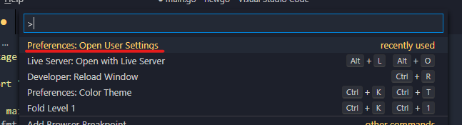
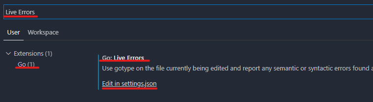
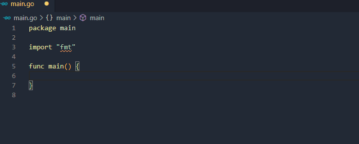
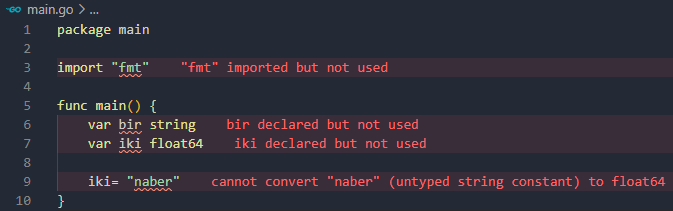
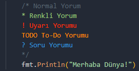

# Visual Studio Code için Golang Özelleştirmeleri

Bu yazıda Visual Studio Code üzerinde Golang için kullanabileceğimiz özelleştirmelerden bahsedeceğiz. Bu özelleştirmeler sayeseinde kod yazma deneyimimizi iyileştirebiliriz.

## Canlı Hata Ayıklama

VSCode üzerinde Go dili kodları yazarken farketmişsinizdir. Kodu yazarken hata ayıklamıyor. Sadece dosyayı kaydettiğimizde hata ayıklama işlemi yapıyor. Kod üzerinde canlı hata ayıklamayı aktif etmemiz gerekiyor. Bunun için;

`CTRL + SHIFT + P` tuşlarına beraber basarak, VSCode komut bölümünü açalım. Bu kısma `"Preferences: Open User Settings"` yazalım ve çıkan ilk sonuca girelim.



Açılan `Settings` sekmesinde üst tarafta bulunan arama yapma kutusuna `"Go: Live Errors"` yazalım. Çıkan sonuçta `"Edit in settings.json"` bağlantısına tıklayalım.



```javascript
"go.liveErrors": {
    "enabled": false, //Burayı true yapalım.
    "delay": 500 //tepki süresi
}
```

Açılan editörde `"go.liveErrors"` anahtarının karşısında ayarlarımız var. `"enabled"` anahtarının değerini `true` yapalım. `"delay"` anahtarındaki değerde ise yazdıktan kaç milisaniye sonra hata ayıklama yapacağını belirtiyoruz. `500` (yarım saniye) normal bir değerdir.

Daha sonra bir `.go` dosyası oluşturalım veya hali hazırda `.go` dosyasını açalım. Açtığımız dosyanın içerisine birşeyler yazmaya çalıştığımızda VSCode'un sağ alt köşesinde bir uyarı verecektir. Bu uyarıda **Install** butonuna tıklayarak eklenti yükleme işlemini başlatalım. Bu eklenti canlı hata ayıklama yapmak için gereklidir. Yüklendiğinde **Output** sekmesinde aşağıdakine benzer bir sonuç alacaksınız.

> Tools environment: GOPATH=C:\Users\kaank\go Installing 1 tool at C:\Users\kaank\go\bin in module mode. gotype-live\
> \
> Installing github.com/tylerb/gotype-live (C:\Users\kaank\go\bin\gotype-live.exe) SUCCEEDED\
> \
> All tools successfully installed. You are ready to Go :).

Artık canlı hata ayıklama özelliğini kullanabilirsiniz.



## Go Yazarken Kullanabileceğiniz VSCode Eklentileri

### ErrorLens

Bu eklenti ile kod yazarken eğer hata varsa alakalı satırın sağında hata mesajını görebilirsiniz. Bu eklentiyi Go için kullanmadan önce Go için canlı hata ayıklamayı açmanızı tavsiye ederim _(Yukarıda gösterdim)_.



### Better Comments

Yorum satırlarını daha şık gösteren bir eklentidir. Tavsiye ederim. Satırın başına koyduğunuz işaret veya yazdığınız yazıya göre satırın rengi değişiyor.




