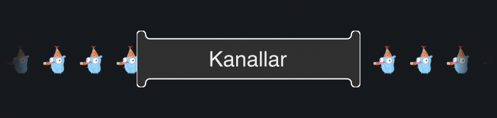

import Channels from "../../../components/Channels.svelte"

Channels (kanallar), Go'da goroutine'ler arasında veri alışverişini sağlamak için kullanılan yapılar olarak tanımlanabilir. Kanallar sayesinde, bir goroutine başka bir goroutine'e veri gönderebilir veya ondan veri alabilir. Kanallar, genellikle eşzamanlı işlemler arasında veri paylaşımı için kullanılır ve Go’nun eşzamanlı programlama modelinin temel yapı taşlarından biridir.

Özet olarak kanallar boru olarak düşünülebilir. Bir taraftan veri gönderilirken, diğer taraftan veri alınabilir.



## Kanalların Kullanımı

Kanallar `make` fonksiyonu ile oluşturulur.

```go
ch := make(chan int)
```

Yukarıdaki örnekte içerisinden `int` tipinde veri aktarılabilen `ch` isminde bir kanal oluşturduk.

## Unbuffered Channels (Arabelleksiz Kanallar)

Önceki örneğimizde tanımladığımız gibi arabelleksiz kanallar `make` fonksiyonu ile tanımlanırken sadece veri aktaracağı tip belirtilir.

```go showLineNumbers=true {9,13,16}
package main

import (
	"fmt"
	"time"
)

func main() {
	ch := make(chan string)

	go func() {
		time.Sleep(1 * time.Second)
		ch <- "hello" // 16. satırdan teslim alınana kadar bekleyecek 
	}()

	a := <-ch // 13. satırdan gönderilene kadar bekleyecek

	fmt.Println(a) // hello
}

```

Burada kanal kullanımı için bir örnek görmekteyiz. Kanallara veri gönderilirken veya okunurken `<-` operatörü kullanılır. Ok operatörü kanalı gösteriyorsa (`ch <- "hello"`) kanala değer gönderilir. Eğer ok kanalın dışına doğru ise (`a := <-ch`) kanaldan veri okunur.

```go
ch <- "selam"
```

Yukarıdaki örnekte `ch` adlı kanala `string` tipinde değer gönderdik. Arabelleksiz (unbuffered) kanallarda veri gönderiminin tamamlanması için gönderilen verinin kanalın diğer ucundan teslim alınması gerekir. Aksi taktirde içerisinde çalışılan goroutine gönderme işlemi tarafından bloklanır.

```go
a := <-ch
```

Örneğimizde `ch` adlı kanaldan gelen veriyi `a` isminde değişkene atadık. Kanala gönderilen değer `string` tipinde olduğu için `a` değişkeninin tipi de `string` kabul edilir. Programımız `ch` kanalından değer gelene kadar bekleyecektir.

Kanallardan okunan değerleri bir değişkene atamadan, sadece veri gelmesini beklemek istiyorsak aşağıdaki gibi kullanabiliriz.

```go
<-ch
```

## Buffered Channels (Arabellekli Kanallar)

Arabellekli kanallar, aynı esnada belirlenen sayıda veri aktarabilen kanallardır. Tanımlanırken boyut belirtilir.

```go showLineNumbers=true {12-15,20-23}
package main

import (
	"fmt"
	"time"
)

func main() {
	ch := make(chan string, 4)

	go func() {
		ch <- "msg1"
		ch <- "msg2"
		ch <- "msg3"
		ch <- "msg4"
		fmt.Println("all msg sent")
	}()

	time.Sleep(2 * time.Second)
	a := <-ch
	b := <-ch
	c := <-ch
	d := <-ch

	fmt.Println(a, b, c, d) // msg1 msg2 msg3 msg4
}

```

Yukarıdaki örnekte aynı anda 4 adet string tipinde veri taşıyabilen bir kanal tanımlanmıştır. 12-15. satırlar arasında kanala değerler gönderilir. 5. kez değer gönderilmek istendiğinde programın bloklanmaması için kanaldan 1 değerin okunması gerekir. 20-23. satırlar arasında ise kanaldan değerler okunur. Dolayısıyla kanala yeni değerler gönderilmesi için yer açılmış olur.

## Canlı Demo

<Channels client:visible/>

## Kanalların Kapatılması
Kanallar kullanılmadığında kapatılması gerekir. Bir kanalı kapatmak için `close` fonksiyonu kullanılır.

```go
ch := make(string)
.
.
.
close(ch)
```
veya içerisinde çalışılan fonksiyon tamamlandığında kapatılması için `defer` ile kullanabiliriz.

```go
ch := make(string)
defer close(ch)
```

Kanalın kapatılmasının hali hazırda dinleme yapan yerler için etkilerine bakalım.

```go showLineNumbers=true {6,10}
ch := make(chan string, 3)

go func() {
	time.Sleep(2 * time.Second)
	ch <- "msg1"
	close(ch)
}()

a := <-ch // "msg1" gelecek
b := <-ch // "" (boş string) gelecek

fmt.Println(a, b) // "msg1" ""
```

Yukarıdaki örneğe göre 5. satırda yazılan değer 9. satırda okunuyor. Devamında 6. satırda kanal kapatılıyor, bu yüzden 10. satırda okuma işlemi kanal kapatıldığından pas geçiliyor ve kanal string veri taşıdığından string'in varsayılan değeri olan `""` (boş string) `b` değişkenine atanıyor.

Okuyucu tarafından boş string alındığında (örneğe göre 10. satır) boş string'in gelmesinin sebebi kanalın kapanması mı yoksa kanala gerçekten de boş string mi yollanmış bunu anlamak için `comma ok` kullanabiliriz.

```go showLineNumbers=true {5,9,10} "ok1" "ok2"
ch := make(chan string, 3)

go func() {
	time.Sleep(2 * time.Second)
	ch <- ""
	close(ch)
}()

a, ok1 := <-ch // "", true
b, ok2 := <-ch // "", false

fmt.Println(a, ok1, b, ok2) // "" true "" false
```
5\. satırda kanala bu sefer boş string değerini yolladık.
9\. satırda kanaldan değer okunduğunda kanal açık olduğu için `ok1` değeri `true` geldi. 10. satırda ise kanal kapalı olduğu için `ok2`'nin değeri `false` geldi. `comma ok` kullanarak kanaldan gelen varsayılan değerin kanal kapandığı için mi, yoksa boş string yollandığı için mi geldiğini anlayabildik. 

## Kanallarda Okuma veya Yazma Kısıtlamaları

Kanallar kullanılması için bir yere gönderilirken gönderildiği yer için okuma veya yazma kısıtlaması içerebilirler. Kısıtlama olmadan göndermek için,

```go
func doSomething(ch chan string) {
	// ch <- "msg" // yazma
	// veya
	// a := <- ch // okuma
}
```

### Sadece-Okuma Modu

:::note[Doğru Kullanım]
```go
func doSomething(ch <-chan string) {
	// a := <- ch // okuma
}
```
:::

:::danger[Yanlış Kullanım]
```go
func doSomething(ch <-chan string) {
	// ch <- "msg" // yazma yapılamaz
}
```
:::

### Sadece-Yazma Modu

:::note[Doğru Kullanım]
```go
func doSomething(ch chan<- string) {
	// ch <- "msg" // yazma
}
```
:::

:::danger[Yanlış Kullanım]
```go
func doSomething(ch chan<- string) {
	// a := <- ch // okuma yapılamaz
}
```
:::

Okuma veya yazma kısıtlamaları fonksiyon return'lerinde de kullanılabilir.

```go
func doSomething() chan string // Kısıtlama olmadan

// veya

func doSomething() <-chan string // Sadece-okuma modu

// veya

func doSomething() chan<- string // Sadece-yazma modu
```

## Range ile Kanaldan Değer Okunması

`range` kullanılarak doğal olarak kanallar kapatılana kadar değer okuma (dinleme) işlemi yapılabilir.

```go title="main.go" showLineNumbers=true {11-14,17-19}
package main

import (
	"fmt"
)

func main() {
	ch := make(chan string)

	go func() {
		ch <- "msg1"
		ch <- "msg2"
		ch <- "msg3"
		close(ch)
	}()

	for v := range ch {
		fmt.Println(v)
	}

	fmt.Println("all msg received")
}
```

`ch` isimli kanalımızı `range` ile kullanarak kanala yazılan (gönderilen) değerleri okuyabiliriz. 11, 12 ve 13. satırlarda değerlerimizi gönderdik. Devamında kanalı `close` kullanarak kapattık. Böylelikle kanalı dinleyen yerler artık kanala bir değer gönderilmeyeceğini bilip dinlemeyi pas geçecektir.

17. satırda ise `range` ile beraber `ch` kanalına gönderilen değerleri okuduk. Kanal kapatılana kadar okuma işlemine devam edildi.

Çıktımız aşağıdaki gibi olacaktır.

```text title="Çıktımız"
msg1
msg2
msg3
all msg received
```

## Kanala Yazma veya Okuma İşlemlerinde Deadlock

Deadlock, iki veya daha fazla goroutine'nin birbirlerini sonsuza dek beklemesinden meydana gelen bir durumdur. Deadlock go runtime'ı tarafından tespit edilebilir. Go runtime deadlock'ı tespit ettiğinde fatal error vererek programdan çıkış yapar.

Yukarıdaki örneği bir de deadlock hatası verecek şekilde yeniden kurgulayalım.

```go showLineNumbers=true del={14}
package main

import (
	"fmt"
)

func main() {
	ch := make(chan string)

	go func() {
		ch <- "msg1"
		ch <- "msg2"
		ch <- "msg3"
		// close(ch)
	}()

	for v := range ch {
		fmt.Println(v)
	}

	fmt.Println("all msg received")
}
```

Yukarıdaki örnekte bu sefer 14. satırda kanalı kapatmıyoruz. Bu yüzden kanalı dinleyen yerler sonsuza kadar dinlemede takılı kaldığı için go runtime deadlock tespit edip fatal error verecektir.

Çıktımızı görelim.

```text {4,8} "main.go:17"
msg1
msg2
msg3
fatal error: all goroutines are asleep - deadlock!

goroutine 1 [chan receive]:
main.main()
        /path/to/example/project/main.go:17 +0xc4
exit status 2
```

Çıktıya göre `main.go:17` satırında deadlock gerçekleştiği belirtiliyor.

Bu sefer yazma esnasında deadlock gerçekleşen bir örnek görelim.

```go title="main.go" showLineNumbers=true {11-15,19-21}
package main

import (
	"fmt"
)

func main() {
	ch := make(chan string)

	go func() {
		for v := range ch {
			fmt.Println(v)
			if v == "msg2" {
				break
			}
		}
	}()

	ch <- "msg1"
	ch <- "msg2"
	ch <- "msg3"
}
```

Örneğimizde yazma ve okuma yerlerini değiştirdik. döngü içerisinde kanalı dinliyorken, eğer kanaldan `msg2` değeri gelirse döngüyü sonlandırması için bir ekleme yaptık. Bu sayede `msg3` değeri gelmeden önce kanalı dinlemeyi kestiğimiz için 21. satırda yeni değer yollanırken kanalı dinleyen bir yer bulunmayacak ve program bloklanacak.

Go runtime'ı deadlock'u tespit edip falat error verecek.

```text {7} "main.go:21"
msg1
msg2
fatal error: all goroutines are asleep - deadlock!

goroutine 1 [chan send]:
main.main()
        /path/to/example/project/main.go:21 +0x9c
exit status 2
```

Çıktımızdaki hatada deadlock'un 21. satırda gerçekleştiğini belirtiyor. Arabelleksiz kanallarda programın bloklanmaması için kanala yazma işlemi yapılırken karşıdan okunması gerekir. Kanaldan okuma yapılana kadar yazma işlemi beklenir.