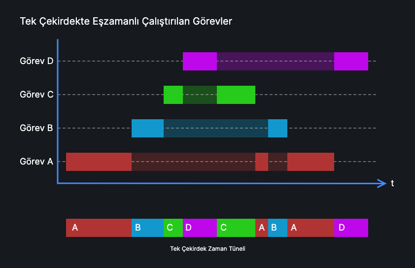
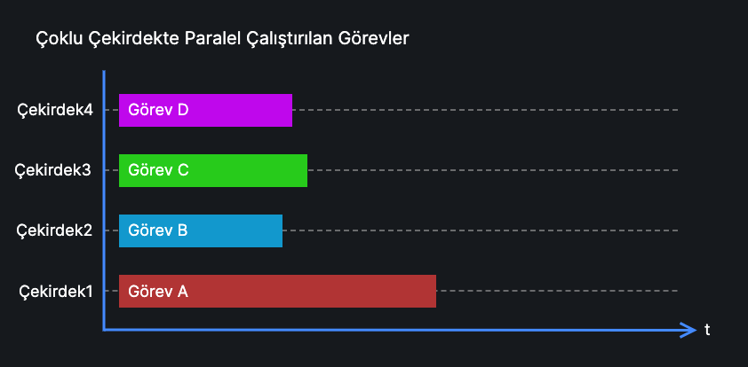
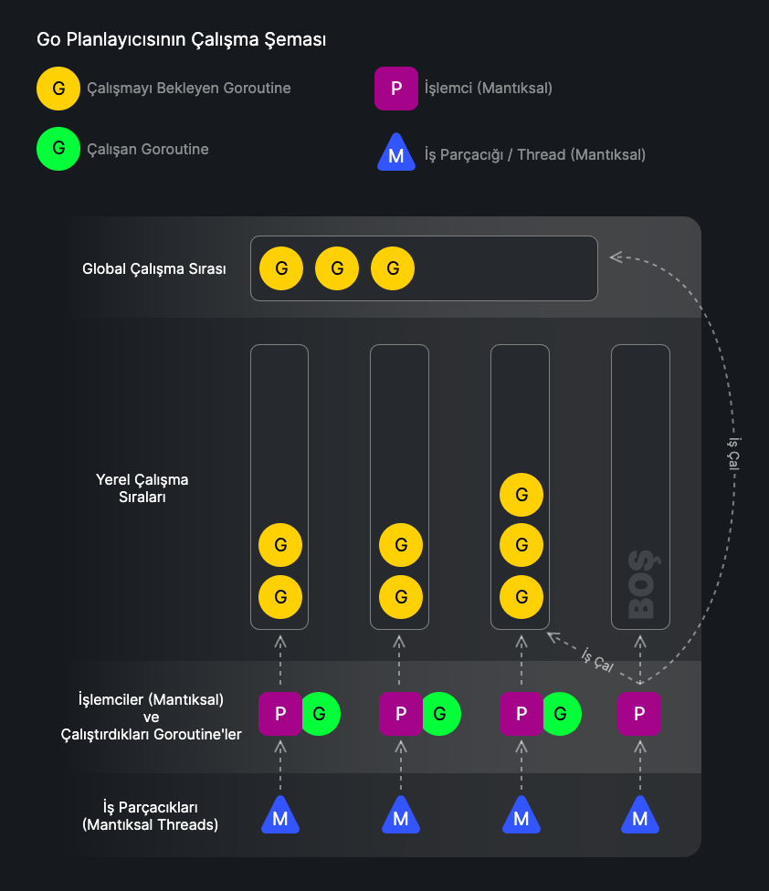

:::note[Yazar Notu]
Bu konunun yazımını bitirdikten sonra yeni başlayan kişiler için karışık bir konu olduğunu düşünerek, Go programlama dilinde eşzamanlı ve paralel programlama yapmak için aşağıdaki anlatılan konuların tamamını bilmeniz gerekmediğini söylemeliyim. Sadece Go'da bu mekanizmaların hangi mantıkta çalıştığını görmek için okunabilecek güzel bir konu olabilir diye yazdım.
:::

## Eşzamanlılık Nedir?

Eşzamanlılık (concurrency), bir programın aynı anda birden fazla işi veya görevi ele alabilme yeteneğidir. Bu, birden fazla görevin aynı zaman diliminde yönetilebilmesi anlamına gelir, ancak bu görevlerin gerçekten aynı anda yürütülmesi gerekmez. Eşzamanlılık, görevlerin birbiriyle örtüşen zaman dilimlerinde ilerlemesine izin verir, böylece sistem kaynaklarının etkin kullanımı sağlanır. Eşzamanlılık, kullanıcı etkileşimlerinin hızlı ve duyarlı olmasını sağlamak için kritik öneme sahiptir.



Çizimde gösterilen görevlerdeki yarı transparan alanlar görevin beklemeye müsait olduğu veya başka bir görev yürütüldüğü için beklediği aralık olarak düşünülebilir.


## Paralellik Nedir?

Paralellik (parallelism), bir programın aynı anda birden fazla görevi gerçekten aynı anda yürütme yeteneğidir. Bu genellikle çoklu işlemci çekirdekleri veya çoklu işlemciler kullanılarak gerçekleştirilir. Paralellik, büyük veri setlerini işlemek veya karmaşık hesaplamaları hızlandırmak için kullanılır. Paralellik, aynı anda birden fazla işin fiziksel olarak yürütülmesini sağlar ve bu sayede işlem süreleri önemli ölçüde azaltılabilir.



## Go'da Eşzamanlılık ve Paralellik

Go, eşzamanlılık ve paralellik kavramlarını uygulamak için güçlü araçlar sunar. Go'da eşzamanlılık, goroutine'ler ve channels (kanallar) aracılığıyla yönetilir. Bu araçlar kullanımı ile eşzamanlı işlemlerin yönetimi daha basite indirgenebilmiştir.

:::note
Goroutine ve Channels konularına daha detaylı bakmak için kendi konu sayfalarına bakabilirsiniz. Aşağıda hızlıca geçilmiştir.
:::

### Goroutine'ler
Goroutine'ler, hafif ve düşük maliyetli iş parçacıklarıdır. Go'da bir fonksiyonu goroutine olarak başlatmak için `go` anahtar kelimesi kullanılır:

```go
go func() {
    fmt.Println("Bu bir goroutine'dir")
}()
```

### Channels (Kanallar)
Kanallar, goroutine'ler arasında veri alışverişi ve senkronizasyon sağlamak için kullanılır. Kanallar, veri yarışlarını (race conditions) ve senkronizasyon sorunlarını önler:

```go
c := make(chan int)
go func() {
    c <- 42
}()
value := <-c
fmt.Println(value) // 42
```

## Go, Eşzamanlılık ve Paralelliğe Nasıl Karar Verir?

Go runtime'ı, eşzamanlılık ve paralellik yönetimini otomatik olarak gerçekleştiren bir planlayıcıya (Go Scheduler) sahiptir. Bu planlayıcı, goroutine'leri mevcut işlemci çekirdeklerine dağıtarak optimal performans sağlamaya çalışır.

## GOMAXPROCS

`runtime.GOMAXPROCS`, Go runtime'ına aynı anda maksimum kaç işlemci çekirdeğinin kullanılacağını belirtir. Bu, paralelliği kontrol etmenin ana yoludur:

```go
runtime.GOMAXPROCS(4) // 4 işlemci çekirdeği kullan
```

Eğer çalışacağı ortamın çekirdek sayısına bakılarak belirlemek istersek:

```go
runtime.GOMAXPROCS(runtime.NumCPU())
```

Go 1.5 sürümünden itibaren varsayılan olarak kullanılan çekirdek sayısı, çalıştığı sistemin çekirdek sayısına eşittir. Sistemin tüm çekirdeklerini kullanmasını istemiyorsanız, sadece bu durumda maksimum kaç çekirdekte çalışacağını belirtmeniz gerekir.

## Go Planlayıcısı (Go Scheduler)

Go dilinde eşzamanlılık ve paralellik, dilin çalışma zamanı (runtime) tarafından yönetilen bir planlayıcı (scheduler) sayesinde etkili bir şekilde gerçekleştirilir. Bu planlayıcı, goroutine'lerin nasıl ve ne zaman çalıştırılacağını belirler ve sistem kaynaklarının verimli bir şekilde kullanılmasını sağlar.

### Go Planlayıcısının Temel Bileşenleri
Go planlayıcısı, birkaç ana bileşenden oluşur: **G** (goroutine), **M** (iş parçacığı), ve **P** (işlemci). Bu bileşenlerin etkileşimi, Go'nun eşzamanlı ve paralel programları etkin bir şekilde yönetmesini sağlar.

- **Goroutine (G):** Goroutine, Go'da hafif iş parçacığıdır. Her Goroutine, bir fonksiyonun veya metodun çalıştırılması için gerekli olan durum bilgilerini içerir.

- **Thread (M):** M, işletim sistemi iş parçacığını temsil eder. İş parçacıkları (M), Goroutine'leri (G) çalıştırmak için kullanılır.

- **Processor (P):** İşlemci (P), Goroutine'nin (G)  iş parçacığı (Thread / M) üzerinde çalıştırılması için gerekli olan kaynakları (örneğin, yerel çalışma sırasını) yönetir. İşlemci, Go planlayıcısının iş yükünü dengelemek için kullanılır. (Buradaki işlemci donanım olan işlemciden farklıdır)

Bu bileşenlerin nasıl etkileştiğini anlamak için Go çalışma zamanının işleyişine bakalım.

### Go Planlayıcısının İşleyişi

Go çalışma zamanı, Goroutine'leri (G) iş parçacıkları (Thread / M) üzerinde çalıştırmak için İşlemcileri (P) kullanır. Bu bileşenlerin etkileşimi aşağıdaki adımlarla gerçekleşir:

1. **Başlatma:** Program başlatıldığında, Go çalışma zamanı belirli sayıda işlemci (P) oluşturur. Bu sayı varsayılan olarak makinedeki CPU çekirdek sayısına eşittir, ancak `runtime.GOMAXPROCS` fonksiyonu ile değiştirilebilir.

2. **Goroutine Oluşturma:** Yeni bir goroutine oluşturulduğunda, G nesnesi oluşturulur ve bir P'nin çalışma sırasına eklenir.

3. **Planlama:** P, kendi çalışma sırasından G'leri alır ve bunları çalıştırmak için bir M'ye atar. Eğer bir P'nin çalışma sırası boşsa, başka bir P'nin çalışma sırasından iş çalmaya çalışır (work stealing).

4. **Yürütme:** M, G'yi yürütür. G, tamamlanana veya bekleme durumuna (örneğin, kanal operasyonu, I/O bekleme) gelene kadar çalışır. Bekleyen G'ler uygun olduğunda yeniden yürütülmek üzere çalışma sırasına geri konur.

### Go Planlayıcısında İş Çalma (Work Stealing)

İş çalma algoritması, işlemcilerin (P) dengeli bir iş yükü sağlamasını hedefler. Bir işlemcinin (P) çalışma sırası boşaldığında, başka bir işlemcinin (P) çalışma sırasından Goroutine (G) çalarak kendi sırasına ekler. Bu mekanizma, sistem kaynaklarının verimli kullanılmasını ve iş yükünün dengeli dağıtılmasını sağlar.

### Go Planlayıcısında Kesme (Preemption)

Go planlayıcısı, uzun süre çalışan Goroutine'leri (G) kesmek ve diğer Goroutine'lere çalışma zamanı sağlamak için kesme (preemption) mekanizmasını kullanır. Bu, tek bir Goroutine'nin uzun süre CPU'yu işgal etmesini engeller ve diğer Goroutine'lerin de çalışmasını sağlar. Go 1.14 sürümünden itibaren, planlayıcı Goroutine'leri belirli bir süre sonra keser ve diğer Goroutine'lere öncelik verir.

### Go Planlayıcının Çöp Toplayıcı ile Etkileşimi

Go planlayıcısı, çöp toplama süreçleriyle de etkileşir. Çöp toplayıcı, bellek yönetimini optimize etmek için arka planda çalışır ve Goroutine'leri durdurmadan (kesmeden anlamında) minimum kesinti ile bellek temizliği yapar. Planlayıcı ve çöp toplayıcı arasındaki bu işbirliği, uygulamaların performansını artırır.



Yukarıdaki şemada Goroutine'leri sırayla yürütmeye çalışan işlemcileri (P) görmekteyiz. En sağdaki işlemcinin yürüteceği bir Goroutine (G) kalmadığı için global veya diğer işlemcilerin yerel sıralarından Goroutine çalacağını öngörebiliriz.

Go planlayıcısı, eşzamanlı ve paralel programlamayı etkili ve verimli bir şekilde yönetmek için tasarlanmıştır. G, M ve P bileşenlerinin etkileşimi, iş yükünün dengeli dağıtılmasını ve sistem kaynaklarının optimal kullanılmasını sağlar. Go planlayıcısının bu güçlü özellikleri, yüksek performanslı ve ölçeklenebilir uygulamalar geliştirmeyi mümkün kılar.