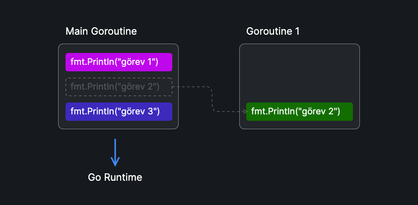

Goroutine'ler, Go runtime tarafından yönetilen hafif iş parçacıklarıdır. İşletim sistemi tarafından yönetilen geleneksel thread'lerin (iş parçacıkları) aksine daha hafif ve verimlidir. Goroutine'ler aynı anda birçok görevi yerine getirebilen yüksek eşzamanlı programlar yazmayı kolaylaştırmak için tasarlanmıştır.

Goroutine'ler `go` anahtar kelimesi ile başlatılır. Bir fonksiyonun veya metodun başına `go` anahtar kelimesi eklemek, bu fonksiyonun yeni bir goroutine olarak çalışmasını sağlar.

```go {9}
package main

import (
	"fmt"
)

func main() {
	fmt.Println("görev 1")
	go fmt.Println("görev 2")
	fmt.Println("görev 3")
}
```

Yukarıdaki örnekte, alt alta 3 adet çıktı bastıracak yazdırma fonksiyonlarının çağrıldığını görmekteyiz. `görev 2` yazısının bastırılacağı satırın başına `go` anahtar kelimesi eklenerek `fmt.Println("görev 2")` işleminin bir goroutine olarak başlatıldığını görmekteyiz. Yani bu işlem eşzamanlı olarak çalıştırılmak isteniyor.

Yukarıdaki program çalıştırıldığında şöyle bir çıktı alabiliriz.

```text
görev 1
görev 3
```

Verilen çıktıda `görev 2` satırının eksik olduğunu görüyoruz. Bunun sebebi Go runtime'ının `go fmt.Println("görev 2")` satırının tamamlanmasını beklememesidir.



Go programlarının giriş noktası olan `main` fonksiyonunun kendisi Go planlayıcısı tarafından bir goroutine'de başlatılır. Bu goroutine'e **main goroutine** denir. `fmt.Println("görev 2")` fonksiyonu yeni bir goroutine'de başlatılmak istendiğinde, bu işlem main goroutine'den ayrılarak eşzamanlı olarak çalıştırılmak üzere planlanır.

Fakat Go runtime'ı main goroutine tamamlandığında, diğer çalışan goroutine'lerin tamamlanmasını beklemez. Yani örneğimize göre `fmt.Println("görev 2")` fonksiyonu çalışamadan programın sonlandığını düşünebiliriz.

Bunu görebilmek için bir bekleme süresi ekleyelim.

```go ins={12}
package main

import (
  "fmt"
  "time"
)

func main() {
  fmt.Println("görev 1")
  go fmt.Println("görev 2")
  fmt.Println("görev 3")
  time.Sleep(1 * time.Second)
}

```

Bu durumda çıktımız aşağıdaki gibi olabilir.

```text
görev 1
görev 3
görev 2
```

Son örneğimizde main fonksiyonun tamamlanmasını 1 saniye geciktirerek, o esnada diğer goroutine'in tamamlanmasını sağlayabildik.