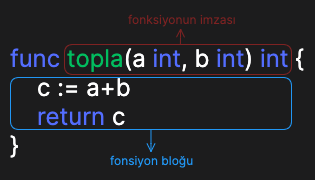

Go dilinde fonksiyonlar, belirli bir görevi yerine getiren kod bloklarıdır. Fonksiyonlar, programınızı modüler hale getirmenize ve kodunuzu daha yönetilebilir kılmanıza yardımcı olan temel yapı taşlarıdır ve türetilmiş veri tipidir.

Go dilinde bir fonksiyon şu şekilde tanımlanır:

```go
func topla(a int, b int) int{
    c := a+b
    return c
}
```

Yukarıdaki örnekte bir fonksiyon tanımlaması görmekteyiz. Fonksiyonlar `func` anahtar kelimesi ile tanımlanır. `topla` olarak isimlendirilmiş, `a` ve `b` olarak adlarında `int` tipinde parametreler alan ve `int` tipinde bir sonuç döndüren fonksiyon tanımladık.



Fonksiyon bloğunda kullanılan `return` anahtar kelimesi, imzada belirtilen `int` dönüş tipinde bir değer döndürür.

Fonksiyonumuzu aşağıdaki gibi çağırabiliriz.

```go
a := 5
b := 10

t := toplam(a,b)
fmt.Println(t) // 15
```

Go'da fonksiyonlar birden fazla değer döndürebilir.

```go
func hesapla(a, b int) (int, int){
    toplam := a+b
    carpim := a*b
    return toplam, carpim
}
```

Yukarıdaki örnekte ilk örnekten farklı olarak `return` tipinde parantez içerisinde 2 adet `int` tipi döneceği belirtilmiştir.

Farklı bir yazım şeklide olarak, fonksiyonun aldığı parametreler kısmında 2 parametrenin tipi aynı olduğu için ilk parametrede tip belirtmeden son `int` parametremiz olan `b` parametresinde tip belirtilmiştir. `a` parametresinde tip belirtilmediği için `b` parametresinin tipi `a` parametresinde de geçerli olacaktır.

Bu fonksiyonu çağırmak istediğimizde aşağıdaki gibi yapabiliriz.

```go
a := 5
b := 10

toplam, carpim := hesapla(a, b)
```

Eğer fonksiyonun döndürdüğü `toplam` veya `carpim` değerlerinden birini kullanmayı düşünmüyorsak, bunun için `_` _(alt tire)_ kullanabiliriz. Bu kullanıma boş tanımlayıcı _(blank identifier)_ denir.

```go
toplam, _ := hesapla(a, b)
// veya
_, carpim := hesapla(a, b)
// veya sonucu kullanmayıp, sadece fonksiyonun
// çalışmasını istiyorsak
hesapla(a, b)
```

Go'da parametrelere isim verebildiğimiz gibi `return` değerlerine de isim verebiliriz.

```go
func hesapla(a, b int) (toplam, carpim int){
    toplam = a+b
    carpim = a*b
    return
}
```

`return` isimlendirmesi yaptığımızda dikkat edeceğiniz üzere, fonksiyon bloğu içerisinde `toplam` ve `carpim` değişkenlerini tanımlamak yerine, bu değişkenlere direkt olarak atama yaptık. Bu değişkenler `return` isimlendirmesi şeklinde tanımlandığı için tekrar tanımlanması gereksizdir. Hali hazırda imza kısmında tanımlanmışlardır.

Bir diğer dikkat edilmesi gereken yer de, fonksiyon bloğunun son satırındaki `return` anahtar kelimesinin yanında döndürülecek sonuçların verilmemiş olmasıdır. Sonuç olarak döndürülmesi gereken `toplam` ve `carpim` değişkenleri isimli `return` olarak tanımladığı için, fonksiyon zaten hangi değerlerin döndürüleceğini bilir. Bu yüzden `return` anahtar kelimesinin yanına bu değişkenleri yazmak zorunlu değildir.

Yine de farklı şartlarda, bu değişkenlerin değerleri değil de, kasıtlı olarak başka değerler döndürülmek istenirse, `return` anahtar kelimesi yanında belirtilebilir.

```go
func hesapla(a, b int) (toplam, carpim int){
    toplam = a+b
    carpim = a*b
    return 0, 0
}
```

Bir fonksiyonun parametrelerinde gelen değerler kullanılmayacaksa aşağıdaki şekilde tanımlanabilirler.

```go
func islemYap(string,a int){
    // sadece a ile ilgili bir işlem yap
}
```

Yukarıdaki örnekte fonksiyonumuz 2 adet parametre almaktadır. İlk parametreye bir isim verilmemiştir. İsim verilmeyen parametreler, fonksiyon çağrım esnasında bir değer gönderilmese bile fonksiyonun içerisinden bu değer kullanılmaz.

Benzer olarak bunu boş tanımlayıcı kullanarak da yapabilirdik.

```go
func islemYap(_ string,a int){
    // sadece a ile ilgili bir işlem yap
}
```

Go programlama dilinde bu tür kullanımlar geçerlidir.