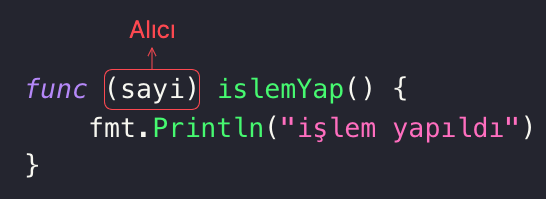

Metodlar (methods), veri tiplerine iliştirilebilen fonksiyonlardır. Go'da metodları kullanabilmek için özel olarak oluşturulmuş veri tiplerini kullanabiliriz.

Örnek bir özel tip oluşturalım.

```go
type sayi int
```

Yukarıdaki örnekte `int` tipinden türetilmiş özel bir tip olan `sayi` tipini görmekteyiz. Özel veri tipi üzerinde çalışacak olan bir metod üretebilmek için bir fonksiyon tanımına ek olarak bu fonksiyonun hangi veri tipine iliştirileceğini belirtmemiz gerekir.

```go
type sayi int

func (sayi) islemYap() {
    fmt.Println("işlem yapıldı")
}
```

Örneğimize göre `sayi` veri tipi üzerinde çalıştırılabilen bir metod ürettik. Fonksiyonun imzasında, fonksiyon adından önce parantezler içerisinde, bu metodun hangi veri tipi üzerinden çağrılabileceğini belirttik. Bu bölüme alıcı (receiver) ismi verilir.



Örnekteki veri tipi üzerinden `islemYap` metodunu aşağıdaki gibi çağırabiliriz.

```go
type sayi int

func (sayi) islemYap() {
	fmt.Println("işlem yapıldı")
}

func main() {
	var a sayi = 10
	a.islemYap() // işlem yapıldı
}
```

`sayi` veri tipi ile oluşturulan bir değişkenin içerisindeki değeri okumak için alıcıya bir isim vermemiz gerekir.

```go
type sayi int

func (s sayi) islemYap() {
	fmt.Println("değer: ", s)
}

func main() {
	var a sayi = 10
	a.islemYap() // değer:  10
}
```

`islemYap` metodunun alıcı kısmında, değişkenin değerine `s` üzerinden erişeceğimizi belirttik.

`islemYap` metodu içinde `sayi` veri tipi ile oluşturulmuş değişkenimizin değerini değiştirmek istediğimizde **işaretçi** kullanarak değiştirmemiz gerekir. Çünkü işaretçi kullanmadan `s`'in değerini değiştirdiğimizde, bu değişikli kopya olan değişkenin değerini değiştirir ve bu değişiklik sadece `islemYap` metodunun içerisi için geçerli olur.

Değer değiştirme örneğimizi görelim.

```go
type sayi int

func (s *sayi) islemYap() {
	*s = 15
}

func main() {
	var a sayi = 10
	a.islemYap()
	fmt.Println("değer:", a) // değer: 15
}
```

Örneğe göre `sayi` veri tipinden oluşturulmuş değişkenimizin, `islemYap` metodu çağrıldığında kopyalanmaması için alıcı kısmında işaretçi kullandık.

## Metodları Kullanırken Unutmamamız Gerekenler

1. **Alıcı Türün Seçimi:** Go'da bir metodun alıcı türü, metodun davranışını etkiler. Alıcı türü, değer türü (value type) veya işaretçi türü (pointer type) olabilir. Değer türü alıcı, bir kopya üzerinde çalışırken, işaretçi türü alıcı orijinal değeri değiştirebilir. Alıcı türünü seçerken, beklentileriniz ve programınızdaki türün kullanımını göz önünde bulundurmalısınız.
2. **Metod İsimlendirme:** Go'nun etkili bir dil olmasının nedeni, metod ve fonksiyon isimlendirme konvansiyonlarıdır. İsimlendirmeler genelde kısa, açıklayıcı ve Camel veya Pascal Case şeklinde yapılır. Metodun isimleri, türün özelliğini ve ne yaptığını açık bir şekilde ifade etmelidir.
3. **Paketleme ve Erişim Kontrolü:** Metodlar alıcısı olan tür ile aynı paket üzerinde tanımlanabilir. Bu da alıcı olacak türün metodlarını alıcı tür tanımlamasının, dış bir paket içerisinde yapılamayacağı anlamına gelir. Bir veri tipinin ve metodlarının, oluşturulduğu paket dışarısından çağrılabilmesi için, veri tipinin ve paket dışından çağrılmak istenen metodların baş harflerinin büyük olması gerekir.

    ```go
    package mypackage

    type MyType int // mypackage dışından erişilebilir.

    func (m) doSomething() { // paket dışından çağrılamaz
        ...
    }

    func (m) DoSomething() { // paket dışından çağrılabilir
        ...
    }
    ```
4. **Metodların Fonksiyonlardan Farkı:** Go'da metodlar, fonksiyonlar gibi davranabilir. Ancak bir tür ile ilişkilendirildiklerinde özel bir anlam kazanırlar. Metodlar, bir türün üzerinde çalışan özel fonksiyonlardır.