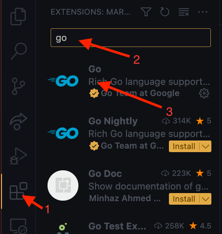
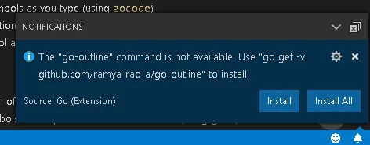

Go geliştirirken sağladığı kolaylıklar göz önünde bulundurulduğunda tercih edebileceğimiz 2 öne çıkan IDE bulunmaktadır.

## GoLand
[GoLand Website](https://www.jetbrains.com/go/)

GoLand, JetBrains tarafından geliştirilen bir entegre geliştirme ortamı (IDE) olan Go programlama dili için özel olarak tasarlanmış bir yazılımdır. GoLand, Go dilini kullanan geliştiricilerin üretkenliğini artırmak için çeşitli özellikler sunar ve Go projelerini geliştirmek için gereken araçları sağlar.

GoLand, geliştiricilere kod yazma, hata ayıklama, test yazma ve performans analizi gibi bir dizi özellik sunar. İşte GoLand'in bazı önemli özellikleri:

**Akıllı Kod Tamamlama:** GoLand, geliştirirken hızlı ve doğru kod tamamlama özelliği sunar. Kod yazarken, IDE, mevcut değişkenler, fonksiyonlar ve paketler gibi öğeleri otomatik olarak algılar ve önerilerde bulunur.

**Hata Ayıklama ve Test Desteği:** GoLand, geliştiricilerin hata ayıklama sürecini kolaylaştıran kapsamlı bir hata ayıklama aracı sunar. Ayrıca, test yazma, çalıştırma ve sonuçları görüntüleme konusunda da güçlü bir destek sağlar.

**Verimli Arayüz:** GoLand, geliştiricilerin daha verimli çalışmasını sağlamak için sezgisel bir kullanıcı arayüzü sunar. Birden çok dosya ve projeyi aynı anda yönetebilir, hızlı gezinme ve arama özelliklerinden yararlanabilirsiniz.

**Entegre Araçlar:** GoLand, Git, Mercurial ve SVN gibi popüler sürüm kontrol sistemleriyle entegre çalışır. Ayrıca, Docker, Kubernetes ve diğer konteyner teknolojileriyle entegrasyon da sağlar.

**Refaktoring Desteği:** Go dilinde kodu yeniden düzenleme ihtiyacınız olduğunda, GoLand size refaktoring araçlarıyla yardımcı olur. Değişken adlarını değiştirme, fonksiyonları yeniden düzenleme ve gereksiz kodu temizleme gibi işlemleri hızlı ve güvenli bir şekilde gerçekleştirebilirsiniz.

**Performans Analizi:** GoLand, performans sorunlarını tespit etmek ve optimize etmek için gelişmiş bir performans analizi aracı sunar. Profiling ve analiz özellikleri sayesinde, uygulamanızın performansını daha iyi anlayabilir ve iyileştirebilirsiniz.

GoLand, Go dilini kullanan geliştiriciler için eksiksiz bir IDE deneyimi sunar. JetBrains'in zengin deneyimi ve sürekli güncellemeleriyle, GoLand, geliştiricilerin daha hızlı ve daha verimli bir şekilde Go projeleri oluşturmasına yardımcı olur.

### GoLand'i Go yazmak için yapılandırma

GoLand IDE'si kurulumu tamanlandığında hali hazırda Go geliştirmeye başlayacağımız bir yapılandırma ile geliyor. O yüzden yapılandırma yapmamıza gerek yoktur.

## Visual Studio Code
[Visual Studio Code Website](https://code.visualstudio.com/)

Visual Studio Code (VS Code), Microsoft tarafından geliştirilen ücretsiz ve açık kaynaklı bir kod düzenleyicidir. Geliştiriciler için tasarlanmış olan VS Code, hafif yapısıyla dikkat çekerken, aynı zamanda genişletilebilirlik ve güçlü özellikler sunar. İster küçük bir proje üzerinde çalışın, ister büyük ölçekli bir uygulama geliştirin, Visual Studio Code size ihtiyacınız olan araçları sağlar.

### VS Code'un özellikleri

**Çoklu Dil Desteği:** Visual Studio Code, birçok programlama dili için zengin destek sunar. HTML, CSS, JavaScript, TypeScript, Python, C#, Java, Go, Ruby ve daha pek çok dilde kod yazabilirsiniz. Ayrıca dil desteğini genişletmek için eklentiler kullanabilirsiniz.

**Hızlı ve Akıllı Kod Tamamlama:** VS Code, kod yazarken size hızlı ve akıllı kod tamamlama özelliği sunar. Değişkenler, fonksiyonlar, sınıflar ve modüller gibi kod öğelerini otomatik olarak algılar ve size öneriler sunar.

**Entegre Hata Ayıklama:** VS Code, hata ayıklama sürecini kolaylaştırmak için entegre bir hata ayıklama aracı sunar. Kodunuzda hata bulun ve hataları adım adım izleyerek çözün. Breakpoint'ler, adım adım yürütme, değişken durumunu izleme gibi özelliklere erişebilirsiniz.

**Güçlü Özelleştirme ve Genişletilebilirlik:** Visual Studio Code, kişiselleştirme ve özelleştirme konusunda esneklik sunar. Temaları, simgeleri, klavye kısayollarını ve diğer ayarları değiştirebilirsiniz. Ayrıca, eklenti ekleyerek veya kendi eklentilerinizi oluşturarak VS Code'un işlevselliğini genişletebilirsiniz.

**Git Entegrasyonu:** VS Code, Git ve diğer sürüm kontrol sistemleriyle entegre olarak çalışır. Dosya değişikliklerini izleyebilir, geçmişe göz atabilir, dal oluşturabilir ve çakışmaları çözebilirsiniz. Ayrıca, VS Code'da çevrimiçi Git deposu yönetimi için kullanışlı araçlar da bulunur.

**Zengin Ekosistem:** Visual Studio Code, büyük bir kullanıcı topluluğuna ve geniş bir eklenti ekosistemine sahiptir. Yüzlerce eklenti ve tema arasından seçim yapabilir ve iş akışınızı daha da geliştirmek için ihtiyaçlarınıza uygun araçlar ekleyebilirsiniz.

Visual Studio Code, hafif yapısı ve zengin özellikleriyle geliştiriciler arasında popüler bir seçim haline gelmiştir. Hem küçük projelerde hızlı bir şekilde kod yazmak için idealdir, hem de büyük ölçekli uygulama geliştirme süreçlerinde güçlü bir araç olarak kullanılabilir.

### VSCode'u Go yazmak için yapılandırma

VSCode taze yüklemede Go programlama dilinde geliştirme yapmak için hazır olarak araçlar ile gelmez. Bu desteği alabilmek için bir kaç işlem yapmamız gerekmektedir.

1. Editörün sol kenarındaki **Extensions** sekmesine tıklayın.
2. Arama bölümüne `go` yazın.
3. Gösterilen eklentiyi kurun.

İlk defa `.go` uzantılı dosya açtığınızda VSCode'un sağ alt kenarında eksik araçlar olduğu uyarısı görünür. `Install All` butonuna basarak eksik araçların kurulmasını sağlayabilirsiniz.

## Özet

Aslında hangi kod editörünü kullandığımızın projemize bir etkisi yok. Sadece kullanım alışkanlıkları ve eklenti desteğine göre kişiden kişiye göre değişebilecek bir kullanım senaryosu olabilir.

:::note[Öğrenciler için]
Jetbrains firmasının yayınladığı IDE'ler ücretlidir. Fakat öğrenci e-postanız varsa bu e-posta ile kayıt olarak, JetBrains'in tüm IDE'lerini ücretsiz kullanabilirsiniz.
:::