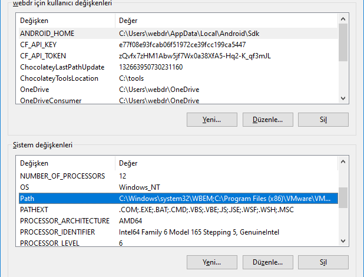
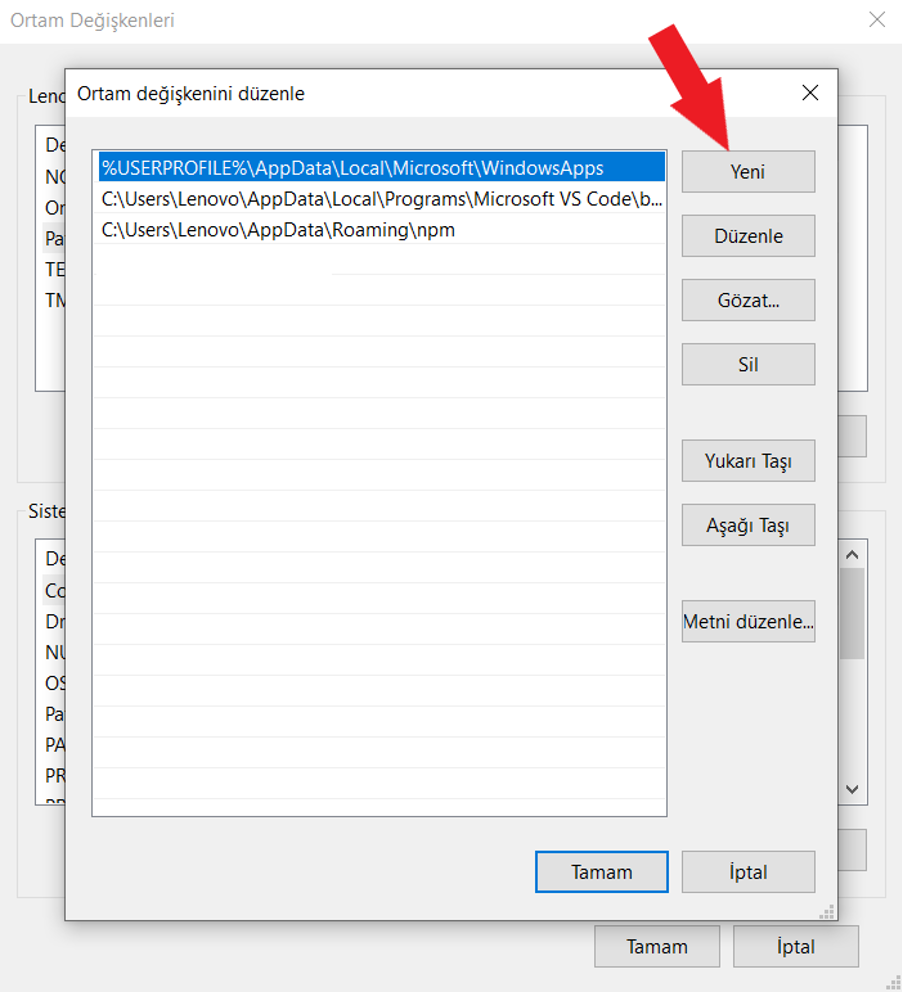

import { Tabs, TabItem } from '@astrojs/starlight/components';

## Go Uygulamalarının Derlenmesi
Go ile yazılan kaynak kodların derlenerek çalışabilir hale gelebilmesi için, `go build` komutu kullanılır. Bu komut ile birlikte derlenmesini istediğimiz _(`main.go` dosyasının bulunduğu)_ dizini belirterek derleme işlemini başlatabiliriz.

main.go dosyamız terminalimizin açık olduğu dizinde ise,

```shell title="Terminal"
go build .
```

farklı bir dizinde ise _(örneğin `cmd/api/main.go`)_

```shell title="Terminal"
go build ./cmd/api
```

Derleme işlemi sonrasında üretilen çalıştırılabilir dosya _(binary)_ varsayılan olarak go module veya `main.go`'nun bulunduğu dizin isminden ilham alınarak, komutun çalıştırıldığı dizin içerisinde oluşturulacaktır.

Oluşturulan çıktının ismini ve dizinini değiştirmek istersek, `-o` flag'i kullanılabilir.

```shell title="Terminal"
go build -o ./dist/myapp ./cmd/api
```

Yukarıdaki komut ile `cmd/api` dizini içerisindeki `main.go` derlenip `build` dizini içerisinde `myapp` adında çalıştırılabilir dosya üretilecektir.

Derleme detaylarını örmek için `-v` _(verbose)_ flag'ini kullanabiliriz.

```shell title="Terminal"
go build -v .
```


## Çapraz-Platform Derleme

Çapraz-platform derleme, aynı kaynak kodunu kullanarak farklı işletim sistemleri ve işlemciler için derlenmiş uygulamalar oluşturmayı ifade eder. Go, bu işlemi oldukça basit hale getiren bir dizi özellik sunar.

Go programlama dilinde çapraz-platform derleme, Go'nun en büyük avantajlarından biridir. Bu özelliği kullanarak, Go ile yazılmış bir uygulamayı farklı işletim sistemleri ve işlemciler için derlemek oldukça kolaydır.

## Go'nun Çapraz-Platform Derleme Avantajları

- **Kolay Kullanım:** Go, platformlara özgü kodları ayırmak veya karmaşık derleme komutları kullanmak zorunda kalmadan çapraz derlemeyi destekler.

- **Derleme Ortamının İzole Edilmesi:** Go, farklı platformlar için gereken derleme araçlarını otomatik olarak indirir ve izole eder. Bu, geliştiricilerin farklı platformlarda uygulama geliştirmelerini kolaylaştırır.

- **Kodun Taşınabilirliği:** Go ile yazılan kodun taşınabilirliği yüksektir. Aynı kod, farklı platformlarda çalışabilir ve aynı işlevselliği sunar.

## Go'da Çapraz-Platform Derleme Nasıl Yapılır?

Go'da çapraz-platform derleme yapmak oldukça basittir. İşte temel adımlar:

**`GOOS` ve `GOARCH` Değişkenleri:** İlk olarak, hedeflediğiniz işletim sistemi ve işlemciyi belirlemeniz gerekir. Bu işlem için `GOOS` ve `GOARCH` gibi çevresel _(env)_ değişkenleri ayarlayabilirsiniz. Örneğin, Linux için derlemek istediğinizde `GOOS="linux"` ve `GOARCH="amd64"` olarak ayarlanabilir.

**Derleme Komutu:** Ardından, belirlediğiniz hedefe göre derleme komutunu çalıştırabilirsiniz. Örneğin:

```shell title="Terminal"
GOOS=linux GOARCH=amd64 go build .
```

Bu komut, Linux üzerinde çalışacak bir uygulamayı derler.

**Farklı Platformlar İçin Tekrarlayın:** İhtiyacınıza göre farklı işletim sistemleri veya işlemciler için tekrarlayabilirsiniz.

**Örnek Bir Senaryo:**

Diyelim ki, bir Go uygulamasını **Linux**, **Windows** ve **macOS** için derlemek istiyorsunuz. İşte bunu nasıl yapabilirsiniz:

```shell title="Terminal"
GOOS=linux GOARCH=amd64 go build .
GOOS=windows GOARCH=amd64 go build .
GOOS=darwin GOARCH=amd64 go build .
```

Bu komutlar, her hedef için uygulamanın derlenmesini sağlar.

Go'nun çapraz-platform derleme yetenekleri sayesinde, yazdığınız uygulamaları farklı işletim sistemleri ve işlemciler için hızlı ve kolay bir şekilde derleyebilirsiniz. Bu özellik, uygulamalarınızın daha geniş bir kullanıcı kitlesi tarafından kullanılmasını sağlar ve geliştirme sürecini daha verimli hale getirir.

## Go'nun Desteklediği Tüm Derleme Hedefleri

Derleyicinin versiyonuna göre desteklediği derleme hedefleri değişebileceği için en iyi kaynağı aşağıdaki komutu çalıştırarak edinebiliriz.

```shell title="Terminal"
go tool dist list
```

Bu yazının yazıldığı tarihteki haline _(go1.21.3)_ bakacak olursak aşağıdaki tablodan görebilirsiniz.

_*Liste harf sırasına göre sıralanmıştır_

| **GOOS**  | **GOARCH** |
|-----------|------------|
| aix       | ppc64      |
| android   | 386        |
| android   | amd64      |
| android   | arm        |
| android   | arm64      |
| darwin    | amd64      |
| darwin    | arm64      |
| dragonfly | amd64      |
| freebsd   | 36         |
| freebsd   | amd64      |
| freebsd   | arm        |
| freebsd   | arm64      |
| freebsd   | riscv64    |
| illumos   | amd64      |
| ios       | amd64      |
| ios       | arm64      |
| js        | wasm       |
| linux     | 386        |
| linux     | amd64      |
| linux     | arm        |
| linux     | arm64      |
| linux     | loong64    |
| linux     | mips       |
| linux     | mips64     |
| linux     | mips64le   |
| linux     | mipsle     |
| linux     | ppc64      |
| linux     | ppc64le    |
| linux     | riscv64    |
| linux     | s390x      |
| netbsd    | 386        |
| netbsd    | amd64      |
| netbsd    | arm        |
| netbsd    | arm64      |
| openbsd   | 386        |
| openbsd   | amd64      |
| openbsd   | arm        |
| openbsd   | arm64      |
| plan9     | 386        |
| plan9     | amd64      |
| plan9     | arm        |
| solaris   | amd64      |
| wasip1    | wasm       |
| windows   | 386        |
| windows   | amd64      |
| windows   | arm        |
| windows   | arm64      |

## Go Uygulamalarının Yüklenmesi
Go ile yazılarak oluşturulmuş projelerin derlenerek sisteme yüklenmesini kolaylaştırmak için `go install` komutunu kullanabiliriz. Bu komut Go projesini derler ve üretilen çalıştırılabilir dosyayı `$GOPATH/bin` klasörü içerisine taşır. Böylece terminal üzerinden sistem genelinde, derlenmiş olan Go uygulamasını kullanabiliriz.

Tabi ki bir ayrıntının farkında olmamız gerekir. `$GOPATH/bin` dizinini Windows'ta ortam değişkenlerine, Unix-benzeri işletim sistemlerinde `PATH`'e eklemeliyiz.

GOPATH çoğu durumda varsayılan olarak kullanıcı dizinimizin içerisindeki `go` dizini olur. Bu dizinin içerisindeki `bin` dizinini `PATH` veya ortam değişkeni olarak eklemeliyiz.
<Tabs>
    <TabItem value="ms-windows" label="Microsoft Windows" default>
        1. Başlat menüsünden **Ortam Değişkenleri**'ni aratın.
        2. Sistem veya kullanıcı kapsamında kullanmanıza bağlı olarak **Yeni** butonuna basın.
           
        3. **Yeni** butonuna basarak kullanıcı dizininizdeki `go\bin` dizinini girin.
           
    </TabItem>
    <TabItem value="unix-like" label="Unix-benzeri (macOS, GNU/Linux...)">
        1. Kullanılan komut istemcisini öğrenmek için,
           ```shell title="Terminal"
           echo $SHELL
           ```
           Büyük çoğunlukla `bash` veya `zsh` kullandığı için bunlarla karşılaşmanız mümkündür.
        2. `bash` kullanıyorsanız,
           ```shell title="Terminal"
           echo 'export PATH="$PATH:$USER/go/bin"' >> ~/.bashrc
           ```
           `zsh` kullanıyorsanız,
           ```shell title="Terminal"
           echo 'export PATH="$PATH:$USER/go/bin"' >> ~/.zshrc
           ```
        3. Terminalinizi yeniden başlatın.
    </TabItem>
</Tabs>

Yukarıdaki adımları tamamladıktan sonra `go install` komutu ile yüklediğimiz Go uygulamlarını terminalimizden çalıştırabilir hale geleceğiz.

Geliştirmiş olduğumuz projeyi yüklemek için aşağıdaki şekilde kullanabiliriz.

```shell title="Terminal"
go install .
```

veya `main.go` dosyamız farklı bir dizinde ise,

```shell title="Terminal"
go install ./cmd/api
```

:::note[Bilgi]
`go build` komutundaki tüm flag'ler veya parametreler `go install` komutu için de geçerlidir.
:::

Bir VCS platformu üzerinden uygulama kurulumu yapmak için, örnek olarak,

```shell title="Terminal"
go install github.com/cosmtrek/air@latest
```

:::note[Bilgi]
VCS URL'inin sonundaki `@latest` eki ile son versiyonun yüklenmesini sağladık.

`@latest` eki belirtilmesse varsayılan olarak yine son versiyonu kuracaktır.
:::

Belirli bir versiyonun kurulmasını istiyorsak,

```shell title="Terminal"
go install github.com/cosmtrek/air@v1.49.0
```
Yükleme işleminden sonra terminale `air` komutunu girerek çalıştığını gözlemleyebilirsiniz.