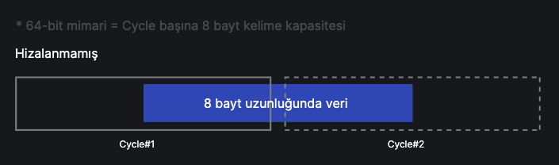
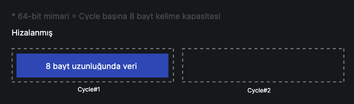
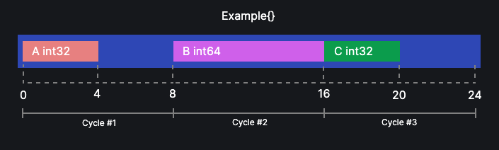
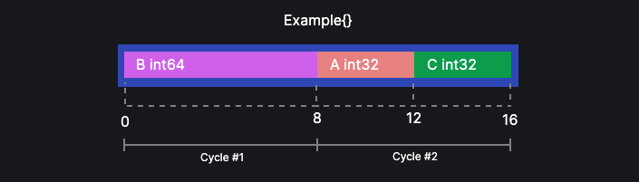

import { LinkCard } from '@astrojs/starlight/components';

## Alan Hizalama Nedir?

Alan hizalamanın (field alignment) tanımı için, struct'lardaki alanların daha verimli bellek kullanımı için hizalanması veya sıralanması olarak bahsedebiliriz.

Aslında alan hizalamayı otomatik yapan araçlar mevcut ve çoğunlukla da bu araçlar ile yapılıyor. Fakat alan hizalamanın mantığını anlayabilmek için neden gerekli olduğunu ve nasıl manuel olarak yapabileceğimize bakacağız.

## Alan Hizalama Neden Gerekli?

Bildiğimiz üzere, günlük hayatta en çok karşılaştığımız işlemci mimarileri, 32-bit ve 64-bit mimariler. Bu mimarileri uygulayan temel işlemci türleri ise amd64, 386, arm ve arm64 gibi çokça kullanılan türlerdir.

Konuya işlemci mimarilerinden bahsederek başlamamızın sebebi, işlemci mimarisinin field alignment yaparken etkin bir faktör olmasıdır. Alanları düzgün hizalanmamış bir struct bazı mimarilerde verimsiz çalışabilir.

Her mimarinin cycle _(adım veya döngü seferi denebilir)_ başına veri işleme kapasitesi vardır.

:::note[32-bit vs 64-bit]
Bu iki mimari arasındaki en temel fark, 32-bit işlemcilerde her bir cpu cycle'da 32-bit (4 byte), 64-bit işlemcilerde ise her bir cycle'da 64-bit (8 byte) işlem kapasitesi olmasıdır.

Bu kapasiteye `word capacity` (kelime kapasitesi) denir.
:::

Bu duruma göre 32-bit üzerinden örnek verirsek, 32-bit mimari 64 bit uzunluğundaki veriyi 2 cycle'da işleyebilirken, 64-bit mimari 64 bit veriyi tek cycle'da işleyebilir diye düşünebiliriz.

64-bit mimari üzerinden bir örnek düşünelim. 64 bit uzunluğundaki veri öbeği her zaman tek seferde okunamayabilir. Bu durumda veri öbeği hizasız gelmiş olabilir.

Bir hizalanmamış veri örneği görelim,

<center></center>

Yukarıdaki şemaya göre 64 bit uzunluğundaki veri düzgün hizalanmadığı için tek cycle yerine 2 cycle'da işlenmiş. Eğer tek cycle'da işlenebilseydi, işgal ettiği 2. cycle başka bir veriyi işleyebilirdi.

Hizalanmış bir veri gelseydi,

<center></center>

Bu şemada ise 64-bit mimari için hizalanmış bir veri gelmiş ve tek cycle'da işlenmiş. Haliyle önceki şemada işgal ettiği 2. cycle başka bir işlem için kullanılabilir olacaktır. Bu yüzden verinin hizalanmış olması işlemci verimliliğini artıracaktır.

:::caution
Konu anlatılırken kullanılan makinenin mimarisi 64-bittir. Bu yüzden devamındaki örnekler 64-bit mimariler üzerinden gösterilmiştir.
:::

## Alan Hizalama Nasıl Yapılır?

Alanların hizalanmamış olmasının neden olduğu verimsizliği gördüğümüze göre, Go'da bu duruma nasıl rastladığımıza ve bu durumu nasıl yöneteceğimize bakalım.

Örnek bir struct tasarımı görelim.

```go
type Example struct {
	A int32 // 4 byte
	B int64 // 8 byte
	C int32 // 4 byte
}
```

Yukarıdaki struct düzgün hizalanmamış. Neden böyle olduğuna bakalım.

Bir struct içerisindeki alanlar tanımlandığı sıra ile işlenir. Yani sırayla A -> B -> C şeklinde. Verimli bir şekilde hizalama yapabilmek için struct içerisindeki alanların veri tiplerinin tükettiği boyuta göre hizalanması gerekir.

```go
type Example struct {
	A int32 // 4 byte
	C int32 // 4 byte
	B int64 // 8 byte
}

// veya

type Example struct {
	B int64 // 8 byte
	A int32 // 4 byte
	C int32 // 4 byte
}
```

Bu örnekte daha düzgün bir hizalama var.

:::tip[Metafor]
Bir struct'ın alanlarını hizalıyorken, struct'ı bir kutu ve struct'ın alanlarını ise kutu içerisine koyduğumuz eşyalar gibi düşünebilirsiniz. Eşyaları ne kadar düzgün yerleştirsek, eşyalara erişimimiz hem o kadar kolay olur, hem de daha küçük bir kutu ile işimiz görülebilir.
:::

İlk örneğimizdeki struct'ın hizalanıp hizalanmadığını nasıl öğreneceğimizi bakalım. Bunu öğrenmek için `reflect` paketinden faydalanabiliriz.

```go
import "reflect"
```

Elimizde aynı **hizalanmamış** struct olsun.

```go
type Example struct { // 24 byte
	A int32 // 4 byte
	B int64 // 8 byte
	C int32 // 4 byte
}
```

`reflect.TypeOf` fonksiyonunu kullanarak bir veri tipi hakkında bilgi edinebiliriz.

```go
to := reflect.TypeOf(Example{})
fmt.Println(to.Size()) // 24
```

Struct içerisindeki alanları `for` yardımıyla döndürüp, her bir alan için bilgi alabiliriz.


```go
to := reflect.TypeOf(Example{})

fmt.Println("Field\t Size\t Offset") // Çıktıdaki tablo başlığımız

for i := range to.NumField() {
	fmt.Println(to.Field(i).Name, "\t", to.Field(i).Type.Size(), "\t", to.Field(i).Offset)
}
```

`to.Field(i).Name` ile döndürülen alanın ismini, `to.Field(i).Type.Size()` alanın veri tipinin bellekte kapladığı alanı ve son olarak `to.Field(i).Offset` ile de ilgili alanın struct'ın başından kendine kadar olan uzaklığını öğrenebiliriz.

Çıktımızı görelim:

```text
Field    Size    Offset
A        4       0
B        8       8
C        4       16
```

Yukarıdaki tablo bize her bir alanın boyutunu ve struct'ın başından alanın kendisine olan uzaklığını bildiriyor. 

Tabloyu yorumlarsak,

`A` alanının boyutu `4 byte` ve offset `0` olduğu için struct'ın başından (0. byte'ından) başlıyor.

`B` alanının boyutu `8 byte` ve offset `8` olduğu için struct'ın 8. byte'ından başlıyor.

`C` alanının boyutu `4 byte` ve offset `16` olduğu için struct'ın 16. byte'ından başlıyor.

Çıktımızdaki tabloyu şemaya dökerek inceleyelim.

<center></center>

Yukarıdaki şemaya baktığımızda, alanlar hizalanırken struct içerisinde 2 yerin boş kaldığını göreceğiz. Alanların yerlerini değiştirerek 3 cycle'da işlenecek struct'ı 2 cycle'da işlenecek hale getirebiliriz.

Daha iyi hizalanmış hali üzerinden devam edelim.

```go
type Example struct { // 16 byte
	B int64 // 8 byte
	A int32 // 4 byte
	C int32 // 4 byte
}
```

Struct'ın alanlarını döndürüp tablomuzu tekrardan oluşturalım.

```text
Field    Size    Offset
B        8       0
A        4       8
C        4       12
```

Tablonun nasıl yorumlanacağını bilgidğimize göre direkt şemaya geçebiliriz.

<center></center>

Struct'ın alanları doğru hizalandığında, 24 bayttan 16 bayta düştüğünü ve 3 cycle yerine 2 cycle'da işlenebildiğini görüyoruz.

## Otomatik Alan Hizalama
Struct içerisindeki alanları otomatik hizalamak için kullanılan bir araca bakalım. Aşağıdaki link üzerinden aracın GitHub sayfasına gidebilirsiniz.

<LinkCard
  title="dkorunic/betteralign"
  description="Make your Go programs use less memory (maybe)"
  href="https://github.com/dkorunic/betteralign"
	target='_blank'
/>

Hizalanması gereken struct'ları tespit edebilmek için kullandığımız komut,

```sh title="Terminal"
betteralign ./...
```

Projedeki tüm struct'ların otomatik hizalanması için kullandığımız komut,

```sh title="Terminal"
betteralign -apply ./...
```