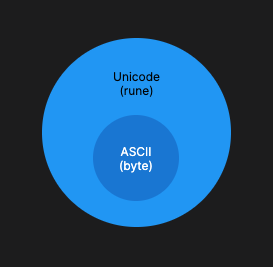
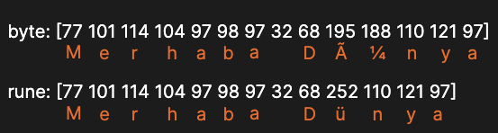

Go programlama dilinde karakter ve dize saklamak için 3 çeşit veri tipi vardır.

- byte
- rune
- string

:::note
Go'da 1 `rune` 1 **Unicode** karakterini, 1 `byte` 1 **ASCII** karakterini temsil eder.

`byte` veri tipi 8bit boyutunda karakter saklayabilirken, `rune` veri tipi 32bit boyutunda karakter saklayabilir. Bu yüzden Go'da `rune` veri tipi aynı zamanda **ASCII** karakterlerini de kapsar ve `byte` veri tipinin süpersetidir.


:::

## Byte
Go dilinde byte veri tipi, özel olarak `uint8` veri tipi ile eşdeğerdir. Bu, byte'ın **0** ile **255** arasındaki tam sayı değerlerini tutabileceği anlamına gelir. `byte` veri tipi genellikle **ASCII** karakterleri temsil etmek için kullanılır.

:::note
ASCII karakterli tablosuna göz atmak için [buraya](https://www.ascii-code.com/) tıklayabilirsiniz.
:::

Örnek bir byte tanımlaması şu şekildedir:

```go
var myByte byte = 'a' // tek tırnak ile tek karakter belirtilebilir.
// veya
var myByte byte = 97 // ASCII tablosunda 'a' karakterinin karşılığı onluk sistemde (decimal) 97'dir.
```

`byte` veri tipi genellikle dizilerle birlikte kullanılır. Özellikle metin verilerini temsil etmek için kullanılan dizilerde byte sıkça karşımıza çıkar. Örneğin:

```go
var myByte = []byte("Hello, World!")
fmt.Println(myByte) // [72 101 108 108 111 44 32 87 111 114 108 100 33]
fmt.Println(string(myByte)) // Hello, World!
```

Yukarıdaki örnekte bir `string` değerin **type casting** uygulanarak `byte` dizisine _(`[]byte`)_ çevrilip tanımlandığını görüyoruz.

:::note
`byte`, Go programlama dilindeki en küçük karakter veri tipidir.
:::

## Rune

`rune`, Go dilinde **Unicode** karakterlerini temsil etmek için kullanılan bir veri tipidir. Her `rune` bir **Unicode** karakterini temsil eder ve genellikle metin işlemeyle ilgili görevlerde kullanılır. `rune` veri tipi, `int32` ile eşdeğerdir, yani 32bitlik bir tam sayıyı temsil eder.

:::note
`rune` veri tipinin 32bitlik bir boyutu olduğu için, `byte` veri tipinin sahip olduğu karakterler ile birlikte, ek karakterlere de sahiptir.

```
rune = 4 X byte
```

Unicode karakter tablosuna göz atmak için [buraya](https://en.wikipedia.org/wiki/List_of_Unicode_characters) tıklayabilirsiniz.
:::

Örnek bir `rune` tanımlaması şu şekilde yapılır.

```go
var myRune rune = 'a' // tek tırnak ile tek karakter belirtilebilir.
// veya
var myRune rune = 97 // Unicode tablosunda 'a' karakterinin karşılığı onluk sistemde (decimal) 97'dir.

fmt.Println(string(myRune)) // a
```

## String

`string` veri tipi, metin veya karakter dizilerini temsil etmek için kullanılan temel bir veri türüdür. `string` türü, metinsel verileri depolamak, işlemek ve manipüle etmek için kullanılır. Çift tırnaklar _(`""`)_ içerisinde belirtilir. İçerisinde birden fazla karakter barındırabilir.

Örnek bir tanımalama yapalım:

```go
var metin string = "Merhaba Dünya"
fmt.Println(metin) // Merhaba Dünya
```

Diğer karakter dizilerine dönüştürüp incelemek istersek;

```go
var metin string = "Merhaba Dünya"
fmt.Println("byte:", []byte(metin))
fmt.Println("rune:", []rune(metin))
```

Çıktımızı inceleyelim.

```
byte: [77 101 114 104 97 98 97 32 68 195 188 110 121 97]
rune: [77 101 114 104 97 98 97 32 68 252 110 121 97]
```

Yukarıdaki çıktıya baktığımızda `byte` dizisine çevrilmiş halinin daha uzun olduğunu göreceğiz. Bunun sebebi "ü" karakterini kullanmamız. **ASCII** karakterleri arasında "ü" karakteri bulunmadığından, bu karakteri gösterebilmek için `195 (Ã)` ve `188 (¼)` karakterlerini birleştirip kullanıyor.



