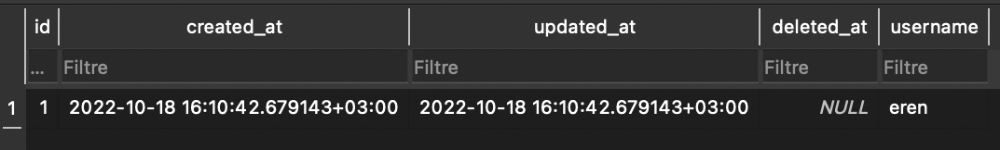

# GORM

**Gorm** kütüphanesi sql kullanımını kolaylaştıran ve az kod ile çok iş yapabileceğiniz bir kütüphanedir. **Gorm** kütüphanesini yüklemek için komut satırına aşağıdakileri yazın.

```
go get -u gorm.io/gorm
```

#### Gorm Özellikleri

* Tam Özellikli ORM
* Hooks (oluşturma/kaydetme/güncelleme/silme/bulmadan önce/sonra)
* Preload, Joins ile istekli yükleme
* İşlemler, İç İçe İşlemler, Kaydetme Noktası, Kaydedilen Noktaya Geri Dönme
* Bağlam, Hazırlanan İfade Modu, DryRun Modu
* Toplu Ekleme, FindInBatches, Map ile Bul/Oluştur, SQL Expr ve Context Valuer ile CRUD
* SQL Builder, Upsert, Locking, Optimizer/Index/Comment İpuçları, Adlandırılmış Bağımsız Değişken, Alt Sorgu
* Bileşik Birincil Anahtar, Dizinler, Kısıtlamalar
* Otomatik Taşıma
* Genişletilebilir, esnek eklenti API: Database Resolver (birden çok veritabanı, okuma/yazma bölme) / Prometheus…
* Geliştirici Dostu

Gorm kütüphanesini kullanabilmemiz için bir sql dili seçmemiz gerekmektedir. Bu öğreticide sqlite kullanacağız. Sqlite kütüphanesini yüklemek için komut satırına aşağıdakileri yazın.

```
go get -u gorm.io/driver/sqlite
```

### **Gorm Kütüphanesinin Kullanımı**

`main.go` dosyamızı oluşturalım. Kütüphanelerimizi import edelim.


```go
import (
	"fmt"
	"gorm.io/driver/sqlite"
	"gorm.io/gorm"
)
```


`"gorm.io/gorm"` kütüphanesi ile gorm fonksiyonlarına erişiyoruz. Gorm ile sqlite entegrasyonunu sağlamak için ise "gorm.io/driver/sqlite" kütüphanesini kullanıyoruz bu kütüphane kullandığını sql diline göre değişiklik göstermektedir. Şimdi basit şekilde veri tabanı bağlantısı ve crud işlemleri nasıl yapılır görelim.

Gorm da manuel olarak tablo oluşturmanız gorm işleyişine tersdir. Bunun yerine bir struct oluşturacağız ve struct içerisine deki özelliklere göre gorm otomatik tablo oluşturacaktır. Struct otomatik tablo çıktı almak için struct içerisinde en üste `gorm.Model` eklentisini eklememiz gerekmektedir.

```go
type User struct {
	gorm.Model
	Username string `gorm:"not null;size:30"`
}
```

`sqlite` **'a** bağlanmak için bizden bir veritabanı adı istiyor bu veritabanını kendi otomatik oluşturacaktır;

```go
db, _ := gorm.Open(sqlite.Open("data.db"), &gorm.Config{})
```

Oluşturmuş olduğumuz struct ile `AutoMigrate()` fonksiyonunu kullanarak tablo oluşturalım. `Create()` fonksiyonu ile oluşturulan tablomuzun içerisine bir `name` ekleyelim.


```go
func main() {
	db, _ := gorm.Open(sqlite.Open("veri.db"), &gorm.Config{})
    	defer db.Close()
	db.AutoMigrate(&User{}) // Tablo oluşturma
	
	db.Create(&User{Username: "eren"}) // Tablo içerisine insert
}
```


Sqlite tablomuz aşağıdaki şekilde gözükmelidir. Gorm otomatik olarak oluşturma, güncelleme ve silinme tarihlerini belirten sütunlar eklemektedir.

<figure><figcaption><p>Tablo görünümü</p></figcaption></figure>

Tablomuza bir veri daha ekleyelim tablo içerisinde **id** ile arama yapabilmek için `First()` fonksiyonunu kullanacağız sonucu terminalden alalım.

```
func main() {
	db, _ := gorm.Open(sqlite.Open("veri.db"), &gorm.Config{})
    	defer db.Close()
	db.AutoMigrate(&User{}) // oluşturma

	db.Create(&User{Username: "furkan"}) //ekleme

	var users User 
	db.First(&users, 2) // id 2 olan kullanıcı getirilecektir.
	fmt.Println(users)
}
```
