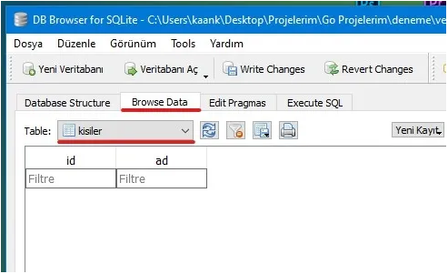

# sqlite3

**sqlite3** kütüphanesi kullanımı kolay ve birkaç aşama ile işlerinizi yapabileceğiniz bir kütüphanedir. **sqlite3** kütüphanesini yüklemek için komut satırına  aşağıdakileri yazın.

> go get github.com/mattn/go-sqlite3

Tablo oluşturma ve düzenleme işlemlerinde bize kolaylık sağlaması için **DB Browser** programına ihtiyacımız olacak. Böylece hızlı bir şekilde veri tabanı olaylarına geçiş yapmış olacağız.\
**DB Browser** programını aşağıdaki adresten indirebilirsiniz.\
[https://sqlitebrowser.org/dl/](https://sqlitebrowser.org/dl/)\
Linux sistemlerin çoğunda **uygulama deposunda** bulunan bir uygulamadır.


Programımızı açıp sol üst taraftan **Yeni Veritabanı**’na tıklayalım.


Veritabanının kayıt yerini, programımızın kodlarının bulunacağı **main.go** dosyası ile aynı yeri seçelim ve ismini **veritabanı.db** olarak kaydedelim. İstediğiniz ismi de verebilirsiniz.


Tablomuzun ismini **kisiler** olarak ayarlayalım. **Alan Ekle**’ye tıklayarak yukarıdaki gibi **id** ve **ad** isminde alanlar oluşturalım. **id** alanının tipini **INTEGER** yaparak, sayısal verileri saklayabilmesini sağlıyoruz. **Birincil Anahtar** ve **Otomatik Arttırma** bölümlerini seçiyoruz. Otomatik Arttırma özelliği sayesinde tabloya veri eklendiğinde **id** içindeki değer her eklemede artacaktır. Bu da her satır için ayırıcı bir özellik olacaktır. **ad** alanının tipini **TEXT** yapıyoruz. **OK** butonuna basarak tabloyu oluşturuyoruz.

\
Böylelikle içerisinde adları depolayabileceğimiz bir veri tabanı olşturmuş olacağız. Oluşturduğumuz tablo her **ad** alanını belirterek veri ekleyişimizde o verinin yanındaki **id** alanına satıra özel numara verecektir.



Tablomuz içindeki kayıtları görmek için **Browse Data** sekmesine tıklayalım. **Table** kısmının yanında tablo oluştururken yazdığımız **kisiler** seçeneğini seçelim. Şuanlık tablomuz boş. Çünkü içine bir kayıtta bulunmadık. **DB Browser** programına bize yardımcı olduğu için teşekkür ederek artık Golang kodlama tarafına geçebiliriz.\


**sqlite3 Kütüphanesinin Kullanımı**\
**main.go** dosyamızı oluşturalım. Kütüphanelerimizi import edelim.

```go
import (
 "database/sql"
 "fmt"
 _ "github.com/mattn/go-sqlite3"
)
```

**database/sql** ile Go üzerinde veri tabanı işlemleri yapabiliyoruz. **fmt**’yi zaten biliyoruz. **github.com/mattn/go-sqlite3** ile de **sqlite3** kullanarak veritabanımızı yönetebiliriz. Buranın başına **\_ (alt tire)** eklememizin sebebi **vscode** programı bu kütüphanenin kod içersinde kullanılmadığını düşünerek silmesini önlemek içindir. Basit şekilde veri tabanı bağlantısı nasıl yapılır görelim.

```go
package main
import (
 "database/sql"
 "fmt"
 _ "github.com/mattn/go-sqlite3"
)
func main() {
 vt, _ := sql.Open("sqlite3", "./veritabanı.db") //veri tabanı dosyamız
 //Veri tabanı işlemleri için kodları yazacağımız bölüm
 vt.Close() //İşimiz bittikten sonra veri tabanımızı kapatıyoruz
}
```

**sqlite3 Veri Ekleme İşlemi**

```go
func main() {
 vt, _ := sql.Open("sqlite3", "./veritabanı.db")
 işlem, _ := vt.Prepare("INSERT INTO kisiler(ad) values(?)")
 //Hangi bölüme eklenecekse yukarıda orayı belirtiyoruz
 veri, _ := işlem.Exec("Mustafa Kemal ATATÜRK") //Eklenecek değer
 id, _ := veri.LastInsertId() //Son girişin id numarısını aldık
 fmt.Println("Son kişinin id'si", id)
 vt.Close() //İşimiz bittikten sonra veri tabanımızı kapatıyoruz
}
```

**sqlite3 Veri Güncelleme İşlemi**

```go
func main() {
 vt, _ := sql.Open("sqlite3", "./veritabanı.db")
 id:=1
 //değiştirilecek kısmın id numarası
 işlem, _ := vt.Prepare("update kisiler set ad=? where id=?")
 //Güncellenecek kısmı belirtiyoruz
 veri, _ := işlem.Exec("Gazi M. K. ATATÜRK", id)
 //Değişiklik ve Değiştirilen verinin id'si
 değişiklik, _ := veri.RowsAffected()
 fmt.Println("Değişen kişinin id'si: ", değişiklik)
 vt.Close() //İşimiz bittikten sonra veri tabanımızı kapatıyoruz
}
```

**sqlite3 Veri Silme İşlemi**

```go
func main() {
 vt, _ := sql.Open("sqlite3", "./veritabanı.db")
 işlem, _ := vt.Prepare("delete from kisiler where id=?")
 //id numarasına göre sileceğiz
 veri, _ := işlem.Exec(id) //Silinecek kişinin id'si
 değişiklik, _ := veri.RowsAffected() //Silinen kişinin id'sini aldık
 fmt.Println("Silinen kişinin id'si: ", değişiklik)
 vt.Close()
}
```

**sqlite3 Veri Sorgulama İşlemi**

```go
func main() {
 vt, _ := sql.Open("sqlite3", "./veritabanı.db")
 tablo, _ := vt.Query("SELECT * FROM kisiler")
 //Bu kısma sorguyu kullanıcağımız kodları yazacağız.
 tablo.Close() //İşimiz bittiği için tablo sorgulamayı kapattık
 vt.Close() //İşimiz bittikten sonra veri tabanımızı kapatıyoruz
}
```

Yukarıda **kisiler** tablosundaki tüm verileri sorgulamış olduk. Bir sonraki bölümde tablomuzdaki verileri nasıl kullanıcıya gösterebileceğimizi öğreneceğiz.\
**sqlite3 Verileri Sıralama/Gösterme İşlemi**

```go
func main() {
 vt, _ := sql.Open("sqlite3", "./veritabanı.db")
 tablo, _ := vt.Query("SELECT * FROM kisiler")
 var id int
 var ad string
 for tablo.Next() {
  aktarma := tablo.Scan(&id, &ad)
  //Tablo bölümlerini değişkenlere aktardık
  if aktarma == nil { //Boş mu kontol ediyoruz
   fmt.Println("Kişiler listesi boş")
  }else{
   //Boş değilse verileri ekrana bastırıyoruz
   fmt.Println(id, ad)
  }
 }
 tablo.Close() //İşimiz bittiği için tablo sorgulamayı kapattık
 vt.Close() //İşimiz bittikten sonra veri tabanımızı kapatıyoruz
}
```
