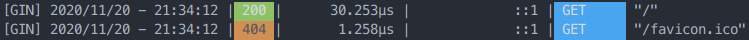
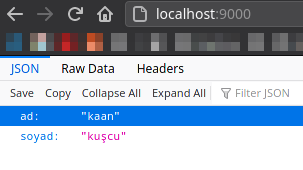

# Gin Web Kütüphanesi

Gin Go'da yazılmış bir web kütüphanesidir. Performans ve üretkenlik odaklıdır. Sizlere basitçe web sunucu ve api oluşturmanız için kolaylık sağlar.

Kurulum için:

> go get -u github.com/gin-gonic/gin

Daha sonra yine aynı yöntemle projemize dahil edebiliriz.

```go
import "github.com/gin-gonic/gin"
```

Basit bir web sunucu oluşturma örneği:

```go
package main

import (
	// kütüphanemizi içeri aktaralım
	"github.com/gin-gonic/gin"
)

func main() {
	//gin'in varsayılan ayarlarında bir yönlendirici oluşturalım.
	router := gin.Default()

	//anasayfayı inde fonksiyonumuz yakalayacak
	router.GET("/", index)

	//daha sonra sunucuyu başlatıyoruz
	router.Run()
}

//anasayfayı yakalayacak olan fonksiyonumuz
func index(c *gin.Context) {
	//c ile gin nesnemize bağlam oluşturduk.
	//c'yi kullanarak artık gin özelliklerine erişebiliriz.

	//sayfaya düz yazı gönderdik
	c.String(200, "Merhaba Dünya")
	//Buradaki 200 sunucudan bir cevap geldiğini anlamına gelir
}
```

Programımızı çalıştırdığımızda aşağıdaki gibi konsol çıktısı alacağız.

> \[GIN-debug] \[WARNING] Creating an Engine instance with the Logger and Recovery middleware already attached.
>
> \[GIN-debug] \[WARNING] Running in "debug" mode. Switch to "release" mode in production.
>
> * using env:   export GIN\_MODE=release
> * using code:  gin.SetMode(gin.ReleaseMode)
>
> \[GIN-debug] GET / --> main.index (3 handlers)\
> \[GIN-debug] Listening and serving HTTP on :8080

Bu çıktıyı incelediğimizde, Gin'in debug (hata ayıklama) modunda çalıştığını söylüyor ve hemen aşağısında sunucumuz ürün haline gelince Gin'i Release Moduna nasıl alacağımızı gösteriyor. Son olarak ise web sunucumuzun `8080` portunda çalıştığınız gösteriyor.

Yukarıdaki örnekte web sunucumuz varsayılan olarak `8080` protunda çalışacaktır. Bunun sebebi `router.Run()`'a parametre olarak port numarası vermememizdir.

Örneğe göre [http://localhost:8080](http://localhost:8080) adresine gittiğimizde komut satırında yeni detaylar belirecek. Tıpkı aşağıdaki gibi:



Bu bilgileri inceleyelim. İlk kayıt anasayfaya bağlanılmaya çalışıldığında alınmış. Bu kayıtta bağlantının zamanını, durum kodunu, bağlantı süresi, bağlantı yöntemini ve hangi adrese bağlantı denendiğini yazıyor. Hemen altındaki ise sitenin ikonuna istek yapmış fakat site ikonumuz bulunmadığı için **404 durum kodu**nu almış. Bu kısımdan da bağlantı isteklerini görebildiğimizi öğrenmiş olduk.

## 🔘 Çıktı Tipleri

### ➡️ JSON Çıktı Verme

```go
func index(c *gin.Context) {
	//JSON Fonksiyonunu kullanıyoruz.
	c.JSON(200, gin.H{
		"ad":    "kaan",
		"soyad": "kuşcu",
	})
}
```

Sonucumuz aşağıdaki gibi olacaktır.



### ➡️ XML Çıktı Verme

```go
//xml için örnek bir yapı oluşturalım
type xmlYapı struct {
	Ad    string `xml:"ad"`
	Soyad string `xml:"soyad"`
}

//anasayfayı yakalayacak olan fonksiyonumuz
func index(c *gin.Context) {
	//xml için örnek bir nesne oluşturduk
	xmlOrnek := xmlYapı{"kaan", "kuşcu"}

	//xml başlığını gönderelim
	c.Writer.WriteString(xml.Header) //<?xml version="1.0" encoding="UTF-8"?>

	//xml nesnesini XML fonksiyonu ile yolladık
	c.XML(200, xmlOrnek)
}
```

Bu kodlar sonucunda sayfamızı açtığımızda "kaankuşcu" sonucu göreceğiz. XML tipinde görmek için sayfanıza sağ tıklayıp "_Sayfa Kaynağını Gör_"e tıklayarak kontrol edebilirsiniz.

.png>)


### ➡️ Template Kullanımı

Template hakkında bilginiz yoksa önce aşağıdaki dökümanı okumanız önerilir.


[html-sablonlar-templates.md](../html-sablonlar-templates.md)


Gin'de template (şablon) işlemleri bayağı kolaylaştırılmış. Ufak bir örnek uygulama yazalım. Öncelikle projemizin ana dizinine `templates` isimli bir klasör oluşturalım ve içerisine `index.html` dosyası oluşturalım. `index.html` dosyamızın içeriği ise aşağıdaki gibi olsun.

```markup
<html>
	<h1>
		{{ .başlık }}
	</h1>
</html>
```

Burada `{{ .başlık }}` yerine Go'dan değer göndereceğiz.

`main.go` dosyamız ise aşağıdaki gibi olsun.

```go
package main

import (
	"github.com/gin-gonic/gin"
)

func main() {
	router := gin.Default()

	//Burada templates klasörünün içindeki tüm şablonları
	//yüklemesini isteyelim.
	router.LoadHTMLGlob("templates/*")

	router.GET("/", index)

	router.Run()
}

func index(c *gin.Context) {

	//HTML şablonunu almak için
	//HTML fonksiyonunu kullanıyoruz.
	c.HTML(200, "index.html", gin.H{
		//Şablondaki başlık yerine Anasayfa yazısını yollayalım.
		"başlık": "Anasayfa",
	})
}
```

Web sunucumuza bağlandığımızda ise **Anasayfa** yazdığını görebiliriz.

## 🔘 Statik Dosyaları Yayınlama

Web sunucumuzda kullanacağımız Css, JS vb. statik dosyalarımız olabilir. Bunun için `Static` fonksiyonunu kullanabiliriz.

Statik dosyalarımızı projemizin ana dizindeki `statik` klasöründe barındırdığımızı varsayalım.

```go
func main() {
	router := gin.Default()

	//(yönlendirme, klasör-ismi)
	router.Static("/static", "./statik")
	
	router.GET("/", index)

	router.Run(":9000")
}
```

`statik` klasörümüzün içerisinde `index.js` adında bir dosya olduğunu varsayarsak `http://localhost:9000/static/index.js` adresinden ulaşabiliriz.

## 🔘 Bağlantı Metodları

Örnek bağlantı oluştururken GET metoduna değindik. Metodları test ediyorken **Postman**'i kullanabilirsiniz. Ben bu konuda **curl** komut satırı aracını kullanacağım. Detaylarına bakacak olursak:

### ➡️ GET Metodu

`GET` metodu web sunucumuza normal bağlantı yapılırken kullanılır. Hazır bir kaynağı yüklemek için kullanılır.

```go
router.GET("/", index)
```

`index` fonksiyonu ile `GET` metodlu anasayfayı yakalayabilirsiniz.

### ➡️ POST Metodu

POST metodu genellikle form gönderimlerinde kullanılır. Yeni bir kaynak oluşturmak için kullanılır. (Yeni kayıt oluşturma, yeni gönderi oluşturma vb...)

Örnek kullanımını görelim.

```go
package main

import (
	"github.com/gin-gonic/gin"
)

func main() {
	router := gin.Default()

	//Burada templates klasörünün içindeki tüm şablonları
	//yüklemesini isteyelim.
	router.LoadHTMLGlob("templates/*")

	router.GET("/", getIndex)
	router.POST("/", postIndex)

	router.Run(":9000")
}

func getIndex(c *gin.Context) {
	c.String(200, "GET metodu ile bağlanıldı.")
}

func postIndex(c *gin.Context) {
	c.String(200, "POST metodu ile bağlanıldı.")
}
```

Yukarıdaki örnekte anasayfa `GET` ile bağlanıldığında `getIndex`, `POST` ile bağlanıldığında `postIndex` fonksiyonu çalışacak. Tarayıcımızdan girdiğimizde "_GET metodu ile bağlanıldı._" yazısını görürüz. `POST` metodu ile bağlanmak için komut satırına şu komutları yazalım.

> curl -X POST http://localhost:9000

Çıktısı "_POST metodu ile bağlanıldı._" olacaktır.

POST metodu üzerinden değer almayı görelim.

```go
//json verisi için yapımız
type kişi struct {
	Ad    string `json:"ad"`
	Soyad string `json:"soyad"`
}

func postIndex(c *gin.Context) {
	//posttan gelen json'ın kaydedileceği değişken
	var postkişi kişi

	//postan gelen json'ı postkişi'ye atayalım
	c.BindJSON(&postkişi)


	c.String(200, "JSON Veri:")
	//json'ı tekrar post ile gösterelim
	c.JSON(200, postkişi)
}
```

Komut satırına aşağıdaki komutu yazarak çıktısını görebilirsiniz.

> curl -X POST -H "Content-Type: application/json" -d '{"ad":"kaan","soyad":"kuşcu"}' [http://localhost:9000](http://localhost:9000)

### ➡️ Diğer Metodlar

Diğer metodlardan kısaca bahsedelim:

* **PATCH metodu:** Bir kaynak üzerindeki belirli bir alanı değiştirmek için kullanılır.
* **DELETE metodu:** Sunucudaki bir kaynağı silmeye yarar.
* **PUT metodu:** Bir kaynağın yerine başka bir kaynağı koymaya yarar. (Komple değiştirme)
* **HEAD metodu:** Sunucuya tıpkı GET metodu gibi fakat sadece başlığı olan bir istek gönderir.
* **OPTIONS metodu:** Sunucunun desteklediği metodları kontrol etmek için kullanılır.

## 🔘 Adreslendirme

### ➡️ Parametre ile Adreslendirme

Örneğin:


```go
package main

import (
	"github.com/gin-gonic/gin"
)

func main() {
	router := gin.Default()

	router.GET("/blog/:yazı", blog)
	//Buradaki :yazı bizim parametremiz
	//Bu parametre ile hangi blog yazısını
	//göstereceğimizi belirleyeceğiz.

	router.Run(":9000")
}
func blog(c *gin.Context) {
	//yazı parametresininde geleni sayfaİsmi değişkenine atayalım.
	sayfaİsmi := c.Param("yazı")
	c.String(200, "Şuanda "+sayfaİsmi+" blogunu okuyorsunuz.")
}
```

Yukarıdaki örneğe göre [http://localhost:9000/blog/gin%20ile%20sunucu%20geli%C5%9Ftirme](http://localhost:9000/blog/gin%20ile%20sunucu%20geli%C5%9Ftirme) adresine gittiğimizde "_Şuanda gin ile sunucu geliştirme blogunu okuyorsunuz._" yazısı ile karşılacağız.

Tabi ki birden fazla parametre ekleyebilirsiniz.

```go
package main

import (
	"github.com/gin-gonic/gin"
)

func main() {
	router := gin.Default()

	router.GET("/blog/:yazar/:yazı", blog)

	router.Run(":9000")
}
func blog(c *gin.Context) {
	yazar := c.Param("yazar")
	yazı := c.Param("yazı")
	c.String(200, "Yazar: "+yazar+" Yazı: "+yazı)
}
```

### ➡️ Querystring (Sorgu dizesi) ile Adreslendirme

Örneğin:


```go
package main

import (
	"github.com/gin-gonic/gin"
)

func main() {
	router := gin.Default()

	router.GET("/arama", arama)

	router.Run(":9000")
}
func arama(c *gin.Context) {
	tür := c.Query("tur")
	sıralama := c.Query("siralama")
	c.String(200, tür+" türünden filmler "+sıralama+" olarak sıralanıyor.")
}
```

Yukarıdaki örneğe göre [http://localhost:9000/arama?tur=bilim-kurgu\&siralama=imdb](http://localhost:9000/arama?tur=bilim-kurgu\&siralama=imdb) adresine girdiğimizde "_bilim-kurgu türünden filmler imdb olarak sıralanıyor._" yazılı bir sonuç elde edeceğiz.

### Göz atmanızı önerdiğim yazı:



