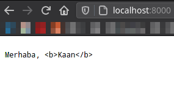
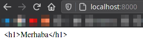
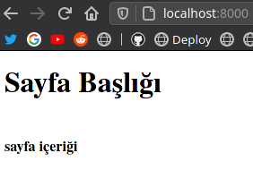

# HTML Şablonlar \(Templates\)

HTML Şablonlar, Golang üzerinde web sayfalarının dinamikliği için kullanılır. Yani şablonlar kullanarak web sayfalarımızın belirlediğimiz bölümlerini Go üzerinden değişikliğe uğratabiliriz.

Bu yazımızda HTML şablonların nasıl oluşturulacağına bakacağız. Çalışma mantığı çok basit. Şablon olarak kullanacağımız html dosyasınında sadece tasarımı yapıyoruz ve dinamik olacak kısımlara ise bir nevi işaretler koyuyoruz. Daha sonra Go bu şablon dosyasını işliyor ve işaret koyduğumuz yerlere gelecek değerleri yerleştiriyor. Düz mantık olarak bu işi yapıyor.

## ✨ Örnek Kullanım

```markup
Merhaba, <b>{{ . }}</b>
```

Yukarıdaki örnekte `{{ }}` süslü parantezler içerisinde . \(nokta\) yazıyor. Bu da Go şablon işlenirken bu kısma Go tarafından vereceğimiz değerin geleceği anlamına geliyor.

Şimdi yukarıdaki örneğimizi `sablon.html` adı ile kaydedelim.

Gelelim Go kodlarımıza;

`main.go` dosyamız aşağıdaki gibi olsun.


```go
package main

import (
	"fmt"
	"html/template"
	"net/http"
)

// yakalayıcı fonksiyonumuz
func anasayfa(w http.ResponseWriter, r *http.Request) {
	//isim değişkenimiz
	isim := "Kaan"

	//burada şablon oluşturuyoruz
	şablon, _ := template.ParseFiles("sablon.html")

	//Burada da şablonu çalıştırmasını ve isim
	//değişkenini kullanmasını istiyoruz.
	şablon.Execute(w, isim)
}
func main() {
	fmt.Println("Sunucu Başladı")

	//ana dizini anasayfa fonksiyonu ile yakalayalım
	http.HandleFunc("/", anasayfa)

	//portu 8000 yapalım ve sunucuyu başlatalım
	http.ListenAndServe(":8000", nil)
}
```


Açıklamaları üstte yazıyor.

Sayfamıza bakmak için [http://localhost:8000](http://localhost:8000) adresine gittiğimizde, şöyle bir sonuç ile karşılaşacağız.



Tabi ki burada bir terslik var. b etiketleri gözüküyor. Bunun sebebi tarayıcımızın sayfayı `html` olarak değil de metin dosyası olarak göstermesi. Çözüm için `sablon.html` dosyamızın başına `<!DOCTYPE html>` ekleyelim. Yani şöyle olacak:


```go
<!DOCTYPE html>
Merhaba, <b>{{ . }}</b>
```



Eğer sadece şablon dosyasında değişiklik yaptıysanız, sunucuyu yeniden başlatmanıza gerek yoktur. Şablon dosyalarındaki değişiklik sunucu açıkken de güncellenir.


Sayfayı yenileyerek değişikliğe bakalım. Çıktımız şöyle olacaktır:


Bu sefer doğru bir çıktı üretmiş olduk.

Bu yöntemler ile sayfamızda istediğimiz bölüme istediğimiz tipte değerler gönderebiliriz.

## ✨ HTML Kodu Gönderme

Bu örneğimizde `sablon.html` dosyamız aşağıdaki gibi olsun.


```go
<!DOCTYPE html>
{{ . }}
```


`main.go` dosyamız da aşağıdaki gibi olsun.


```go
package main

import (
	"fmt"
	"html/template"
	"net/http"
)

func anasayfa(w http.ResponseWriter, r *http.Request) {
	//html kodumuz
	htmlKodu := "<h1>Merhaba</h1>"

	şablon, _ := template.ParseFiles("sablon.html")

	şablon.Execute(w, htmlKodu)
}
func main() {
	fmt.Println("Sunucu Başladı")

	http.HandleFunc("/", anasayfa)

	http.ListenAndServe(":8000", nil)
}
```


Yukarıdaki örnekte sayfamıza bu sefer html kodu yolluyoruz. Çıktımıza bakalım.



Burada yine bir şeyler dönüyor. Çıktı yine istediğimiz gibi değil. "Niye bana yanlış kodları gösteriyorsun Kaan?" dediğinizi duyar gibiyim. Çünkü ilk önce yapmamamız gereken şeyleri gösteriyorum ki daha akılda kalıcı olsun.

Yukarıdaki olayın sebebi şudur: Go tarafından gönderdiğimiz html kodunun aslında `html` tipinde değil de `string` tipinde olması. Bu yüzden html kodumuz düz bir şekilde görünüyor.

Çözüm olarak da Go tarafındaki değişkenimizin tipini `template.HTML` yapacağız. `main.go` dosyamızda `htmlKodu` değişkenimizin tipini değiştirelim.

```go
var htmlKodu template.HTML = "<h1>Merhaba</h1>"
```

veya burada değişkenin tipini değiştirmek yerine `şablon.Execute()` fonksiyonunda değişiklik yapabilirsiniz. \(Hangisi kolayınıza geliyorsa\)

```go
şablon.Execute(w, template.HTML(htmlKodu))
```

## ✨ Şablona Struct Gönderme 

Buraya kadar şablon dosyamıza hep bir tane değer gönderdik. Birden fazla değer göndermek için ne yapmalıyız?

Bu konuda da struct'lardan faydalanabiliriz. Örnek olarak `main.go` dosyamız aşağıdaki gibi olsun.

```go
package main

import (
	"fmt"
	"html/template"
	"net/http"
)

type bilgi struct {
	Başlık string
	İçerik template.HTML
}

func anasayfa(w http.ResponseWriter, r *http.Request) {
	sayfaBilgi := bilgi{
		Başlık: "Sayfa Başlığı",
		İçerik: "<b>sayfa içeriği</b>",
	}
	şablon, _ := template.ParseFiles("sablon.html")
	şablon.Execute(w, sayfaBilgi)
}
func main() {
	fmt.Println("Sunucu Başladı")
	http.HandleFunc("/", anasayfa)
	http.ListenAndServe(":8000", nil)
}
```

Yukarıda `bilgi` isminde bir struct oluşturduk. Bu struct'ımız `Başlık` ve `İçerik` adında alt değişkenlere sahip. Struct'ın elemanlarını isimlendirirken baş harflerinin büyük olmasına dikkat edelim. Çünkü Şablonlar struct değişkenlerini dışa aktarma mantığı ile kullanır. Bu yüzden baş harflerini büyük yazmazsak değişkenleri sayfaya ulaştıramayız.

Daha sonra `anasayfa` fonksiyonumuz içerisinde `sayfaBilgi` adında `bilgi` struct'ı oluşturduk ve değişkenlerimizin değerlerini girdik. Son olarak `sayfaBilgi`'yi şablona gönderdik.

`sablon.html` dosyamız içerisinde ise `sayfaBilg`i'den gelen değişkenleri yerleştirelim.


```go
<!DOCTYPE html>
<h1>{{ .Başlık }}</h1><br>
{{.İçerik}}
```


Yukarıdaki kodlarda dikkat edeceğimiz nokta, tanımlama yaparken noktadan sonra, bilgi struct'ının alt değişkenlerinin ismi ile çağırıyor olmamız.

Çıktımızı görelim:



Buraya kadar şablon mantığını az çok anladığınıza inanıyorum. Buradan sonrasını konu çok uzun olmasın diye hızlıca anlatmaya çalışacağım. Yani buradan sonra çıktıların resimlerini göstermeyeceğim.

## ✨ Şablon İçinde Değişken Atama

Şablon içerisinde oluşturduğumuz değişkenleri tıpkı PHP'deki gibi `$` işareti ile kullanırız.

Öncelikle `main.go` dosyamız aşağıdaki gibi olsun.


```go
package main

import (
	"fmt"
	"html/template"
	"net/http"
)

func anasayfa(w http.ResponseWriter, r *http.Request) {
	şablon, _ := template.ParseFiles("sablon.html")

	//şablona değer göndermeyeceğimiz için burası nil olsun.
	şablon.Execute(w, nil)
}
func main() {
	fmt.Println("Sunucu Başladı")
	http.HandleFunc("/", anasayfa)
	http.ListenAndServe(":8000", nil)
}

```


`sablon.html` dosyamız da aşağıdaki gibi olsun.


```go
<!DOCTYPE html>

{{ $isim := "kaan"}}
{{ $isim }}
```


Yukarıda gördüğünüz gibi değişkeni tanımlarken ve kullanırken başına `$` işareti koyduk. Çıktımızda _"kaan"_ yazacaktır.

## ✨ Şablonda If-Else Kullanımı

```go
{{if .Reşit}}
    Bu kişi reşittir.
{{else}}
    Bu kişi reşit değildir.
{{end}}
```

Yukarıda dikkat etmemiz gereken şey `if-else`'in sonuna `end` eklememiz gerekiyor. Sadece `if` olsaydı bile `end` eklememiz gerekir.

Bu kodları yazdıktan sonra çıkan sonuçta boşluklar \(boşluk tuşunun boşluğu gibi\) oluşabilir. Bunu engellemek için ise aşağıdaki gibi yapabiliriz.

```go
{{if .Reşit}}
    Bu kişi reşittir.
{{- else}}
    Bu kişi reşit değildir.
{{- end}}
```

Yani boşluk oluşan bölgeniz başına `- tire` ekliyoruz.

## ✨ Şablonda Range Döngüsü Kullanımı

Range döngüsü ile web sayfamızın içerisinde bir listenin sıralanmasını sağlayabiliriz.

```go
<ul>
    {{range .Liste}}
        {{.}}
    {{end}}
</ul>
```

## ✨ Şablon İçerisinde Yorum Satırı Oluşturma

Biliyorsunuz ki, HTML kodu içerisindeki yorumlar sayfa kaynağını göstere tıklayınca gözüküyor. Eğer yorumların gözükmesini istemezsek Şablon yorumu olarak yazabiliriz.

```go
{{/* Yorumu buraya yazabilirsiniz */}}
```

