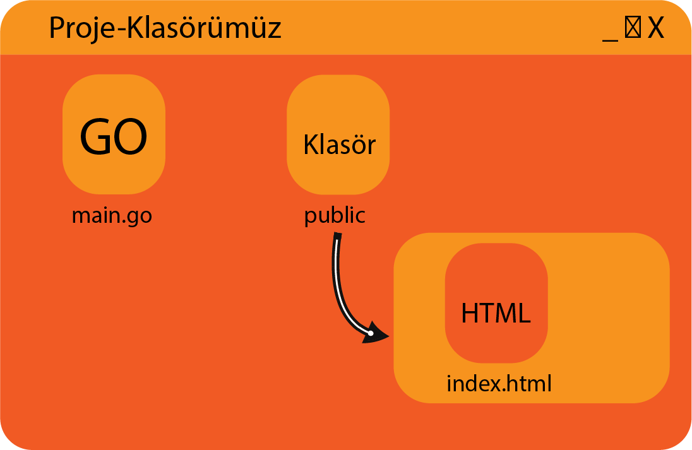

# Statik Kütüphanesi ile Dosyaları Uygulamaya Gömme

Golang’ın müthiş yanlarından biri de bir uygulamayı build ettiğimizde bize tek çalıştırılabilir dosya şeklinde sunmasıdır. Fakat bu özellik sadece **.go** dosyalarını birleştirilmesinde kullanılıyor. Harici dosyalar programa gömülmüyor. Fakat **Statik** isimli kütüphane ile bu işlem mümkün kılınıyor.\
Kütüphanenin mantığından kısaca bahsedeyim. Belirlediğiniz bir dizindeki dosyaları bir kodlamaya çevirerek programın içine dosya gömmek yerine kod gömüyor. Ve bu kodu sanki dosyaymışcasına kullanabiliyoruz. Tabi ki sadece sunucu işlemlerinde işe yarar olduğunu belirtelim.\
Bu yöntemin güzel artı yönleri var.

* Programımız tek dosya halinde kalıyor.
* Programımız kapalı kaynak oluyor.

Tanıtımını yaptığımıza göre hafiften uygulamaya başlayalım.

> go get github.com/rakyll/statik

Konsola yukarıdakini yazarak kütüphanemizi indiriyoruz. Öncelikle dosya ve klasör yapımızı aşağıdaki gibi ayarlıyoruz.



Kodlamaya dönüştürülmesini istediğimiz klasör ile işlem yapıyoruz. Yani **public** klasörü ile. Aşağıdaki komutu **Proje klasörümüz** içerisindeyken yazıyoruz.

> statik -src=/public/klasörünün/adresi -f

Bu işlemle birlikte **public** klasörümüzün yanına statik isimli bir klasör oluşturduk ve içine **statik.go** isimli dosya oluşturmuş olduk. Bu dosyanın içerisinde bizim **public** klasörümüzün kodlanmış hali mevcuttur.\
Ve sırada **main.go** dosyamızı oluşturmakta. Aşağıdaki kodlarıda **main.go** dosyamıza yazıyoruz.

```go
package main
import (
    "net/http"
    "github.com/rakyll/statik/fs"
    _ "./statik" //Oluşturulmuş statik.go dosyasının konumu
)
func main() {
    statikFS, _ := fs.New()
    http.Handle("/", http.StripPrefix("/", http.FileServer(statikFS)))
    http.ListenAndServe(":5555", nil)
}
```

Gerekli kütüphanelerimizi ekledikten sonra **main()** fonksiyomuzun içeriğini inceleyelim.

**statikFS** ve **\_** adında değişkenlerimizi tanımladık. Bu değişkenlerimizi fonksiyonel değişkendir. **\_** koymamızın sebebi **error** çıktısını kullanmak istemediğimizdendir. Eğer lazım olursa kullanabilirsiniz. **fs.New()** diyerek **statikFS** değişkenimizi bir dosya sistemi olarak tanıttık. Daha sonra sunucu oluşturak anadizine ulaşılmak istendiğinde oluşturduğumuz dosya sistemine bağlanmasını sağladık. Artık dosya sistemimize **localhost:5555** üzerinden ulaşılabilir oldu.
