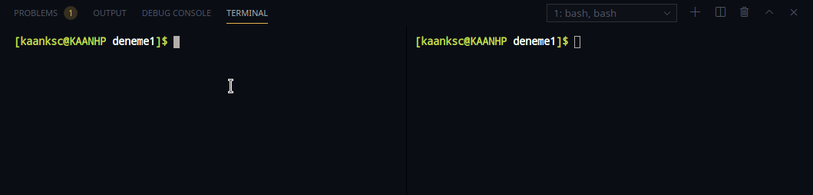

# gRPC

## gRPC Nedir?

gRPC, Google tarafından geliştirilen, açık kaynaklı uzaktan prosedür çağırma \(rpc\) kütüphanesi \(sistemi\)'dir. Aktarım için `HTTP/2` kullanır. Arayüz tanımlama dili olarak `protokol tamponları (buffers)` kullanır. Kimlik doğrulama, Çift yönlü akış, engelleme ve engelleme olmayan bağlantılar, iptal ve zaman aşımı işlemleri için kullanılır.

JSON ve HTTP API'larının aksine, daha katı bir spesifikasyona sahiptirler. Tek bir spesifikasyona sahip olduğu için, gRPC tartışmalarını ortadan kaldırır ve geliştiriciye zaman kazandırır. Çünkü gRPC, platformlar ve uygulamalar arasında tutarlıdır.

Özet olarak, uzaktan prosedür çağırarak client \(müşteri\) ve server \(sunucu\) programları arasındaki iletişimi sağlayan bir kütüphanedir.

## Protokol Tamponları \(Buffers\) Nedir?

İki uygulama arasındaki iletişimin nasıl olacağını belirleyen sözleşmedir.

## Örnek Uygulama Yapalım

Bu örneğimizde sunucuya mesaj gönderip, karşılığında mesaj alan bir uygulama yazacağız. Bir nevi chat uygulaması olacak.

Öncelikle, iletişim protokülünü Go koduna dönüştürebilmemiz \(generating\) için `protoc`'yi bilgisayarımıza kuralım.

İndirmek için [buradaki](https://github.com/protocolbuffers/protobuf/releases/tag/v3.13.0) adrese gidin. Buradaki versiyon v3.13.0 versiyonu. Daha güncel versiyonlar için [buradaki](https://github.com/protocolbuffers/protobuf/releases/) sayfayı kontrol etmeyi unutmayın.

GNU/Linux İS kullanan arkadaşlarımız uygulama depolarından protobuf adıyla yükleyebilirler. Böylece PATH olarak eklemelerine gerek kalmaz.

## Sisteme Yol Olarak Ekleme

Eğer GitHub sayfasından indirdiyseniz, sisteminize dosya yolunu tanıtmanız gerekir. Bunun için örnek olarak;

### Windows üzerinde

Örnek olarak `protoc.exe` dosyamız `C:\\protoc\bin` klasörü içerisinde olsun.

Başlar menüsünde _"Ortam değişkenleri"_ yazarak aratalım. Açılan pencerede _Gelişmiş_ sekmesinde alt tarafta _Ortam Değişkenleri_ butonuna basalım.

_PATH_ seçeneğini _Düzenle_ diyerek `protoc.exe`'nin konumunu ekleyelim.

### GNU/Linux, MacOS vs. Bash Kullanan Sistemler Üzerinde

`protoc` çalıştırılabilir dosyamızı örnek olarak `Home (Ev)` dizinine atmış olalım.

**Örnek:** `~/protoc/bin` olsun.

Ev dizinimizdeki `.bashrc` dosyamızın en altına şunları ekleyelim.

```text
export PATH="~/protoc/bin:$PATH"
```

`.bashrc` dosyasını kaydettikten sonra komut satırına `source ~/.bashrc` yazarak dosyada yaptığımız değişimi onaylayalım.

#### Protoc'yi kontrol edelim

Komut satırına aşağıdakileri yazarak `protoc`'nin versiyonuna bakalım.

```text
protoc --version
```

`Protoc`'ye Golang desteğini eklemek için aşağıdaki paketleri kuralım.

```text
go get google.golang.org/protobuf/cmd/protoc-gen-go
go get google.golang.org/protobuf/cmd/protoc-gen-go-grpc
```

Aynı şekilde Windows üzerinde `C:\\Users\isim\go\bin` klasörünü ekli değilse ortam değişkenlerine ekleyelim. Unix-like sistemler için `~/go/bin`'i path'e ekleyelim.

Yukarıda belirttiğimiz örnek `chat` uygulamasını yazmak için aşağıdaki gibi bir proje yapımız olacak.

```text
.
├── chat
│   └── chat.go
├── chat.proto
├── client.go
└── server.go
```

Client ve Server arasındaki iletişim protokolünü belirleyelim.

`chat.proto` dosyamız şöyle olsun.

```groovy
//Söz dizimi için proto3'ü kullanacağız
syntax = "proto3";

//Go paketi için ayarlarımız
package chat;
option go_package=".;chat";

//iletişimde kullanılacak mesajın yapısı
message Message {
    string body = 1;
    //buradaki 1 sıra numarasıdır. Değer ataması değildir.
}

//rpc servisimiz
service ChatService {
    rpc SayHello(Message) returns (Message) {}
}
```

Yukarıdaki `chat.proto` dosyasını Go koduna dönüştürelim. Bunun için proje dizinindeyken aşağıdaki komutu yazalım.

> protoc --go\_out=plugins=grpc:chat chat.proto

Bu işlem sonucunda chat klasörümüzüm içerisinde `chat.pb.go` dosyamız oluşacak. Bu dosyanın en başında yorum olarak düzenleme yapmamızın uygun olamayacağı yazıyor. O yüzden bu dosyayla çok uğraşmamakta fayda var.

## Server \(Sunucu\) Oluşturalım

`chat` klasörümüzdeki `chat.go` dosyasını oluşturalım.

```go
package chat

import (
	"log"

	"golang.org/x/net/context"
)

type Server struct {
	//Burası şuanlık boş olacak
}

//server nesnemize iliştirilecek fonksiyonumuz
func (s *Server) SayHello(ctx context.Context, message *Message) (*Message, error) {

	//Client'ten gelen mesajı ekrana bastıralım
	log.Printf("Clientten mesaj alındı: %s", message.Body)

	//mesaj gelince değer döndürelim (mesaj ve hata)
	return &Message{Body: "Server'dan merhaba!"}, nil //hata nil olsun
}
```

Go modules'tan faydalanarak chat paketini diğer paketlerde kullanabiliriz. Bunun için proje dizinindeyken komut satırına:

> go mod init github.com/ksckaan1/grpcOrnek

yazalım. Buradaki yaptığımız şey, GitHub'a paket yüklemeden sanal olarak yazdığımız `chat` paketini kullanabileceğiz. Bu komuttan sonra proje dizinimizde `go.mod` dosyası oluşacak. Böylece chat klasörünü paket olarak diğer yerlerde de kullanabileceğiz.

`server.go` dosyamızı oluşturalım.

```go
package main

import (
	"log"
	"net"

	"github.com/ksckaan1/grpcExample/chat"
	"google.golang.org/grpc"
)

func main() {

	//tcp dinleyelim
	lis, err := net.Listen("tcp", ":9080")

	//hata kontrolü yapalım
	if err != nil {
		log.Fatalf("9080 portu dinlenirken hata oluştu: %v \n", err)
	}

	//chat server nesnesi oluşturalım
	s := chat.Server{}

	//grpc server'ı oluşturalım.
	grpcServer := grpc.NewServer()

	//tcp sunucu ile grpc'yi bağlayalım.
	chat.RegisterChatServiceServer(grpcServer, &s)

	//hata kontrolü
	if err := grpcServer.Serve(lis); err != nil {
		log.Fatalf("grpcServer oluşturulurken hata : %v", err)
	}
}
```

`go run server.go` komutunu yazarak test edelim. Eğer çıktı vermiyorsa ve program kapanmıyorsa server dinleniyor demektir. Yani şuana kadar başarılıyız.

## Client \(Müşteri\) Oluşturalım

Şimdi de Server'a mesaj yollayabilmek için Client'i oluşturalım. `client.go` dosyamız aşağıdaki gibi olsun.

```go
package main

import (
	"log"

	//chat klasörünü kullanacağımız için
	//go mod init üzerinde belirlediğimiz deponun
	//sonuna /chat ekliyoruz.
	"github.com/ksckaan1/grpcExample/chat"
	"golang.org/x/net/context"

	//grpc kütüphanemiz
	"google.golang.org/grpc"
)

func main() {

	//grpc client bağlantı nesnesi
	var conn *grpc.ClientConn

	//grpc ye 9080 portunu dinlemesini söyleyelim
	conn, err := grpc.Dial(":9080", grpc.WithInsecure())
	if err != nil {
		log.Fatalf("9080 portu dinlenirken hata oluştu: %v", err)
	}

	//bağlantığı kapatmayı unutmayalım
	defer conn.Close()

	//Client nesnesi oluşturalım
	c := chat.NewChatServiceClient(conn)

	//server'a gönderilecek mesajı belirleyelim
	message := chat.Message{
		Body: "Client'ten merhabalar!",
	}
	
	//Server'dan dönen cevabı alalım
	response, err := c.SayHello(context.Background(), &message)

	//hata kontrolü yapalım.
	if err != nil {
		log.Fatalf("SayHello fonksiyonu çağırılıken hata oluştu: %v", err)
	}

	//server'dan gelen mesajı ekrana bastıralım
	log.Printf("Server'dan gelen cevap: %s", response.Body)
}
```

Yukarıda yazdığımız kodların çalışma mantığını açıklayacak olursak:

1. Server `9080` portunu belirlediğimiz protokol sözleşmesine \(_chat.proto_\) göre dinliyor.
2. `Client.go` dosyamız çalıştırılınca server'a mesaj yolluyor.
3. Client'ten gelen mesajı server ekrana bastırıyor ve bunun karşılığında server client'e cevap veriyor.
4. Server'dan gelen cevabı da client ekrana bastırıyor.
5. Son olarak client programımız sonlanıyor \(kapanıyor\).

Gif olarak sonucu göstermek gerekirse:



